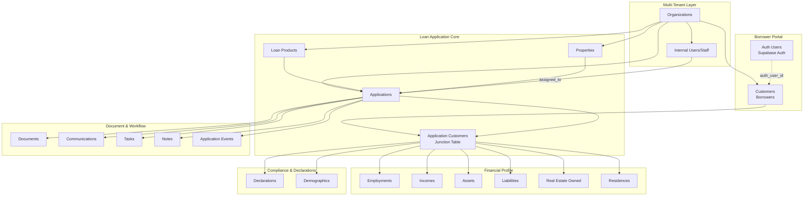
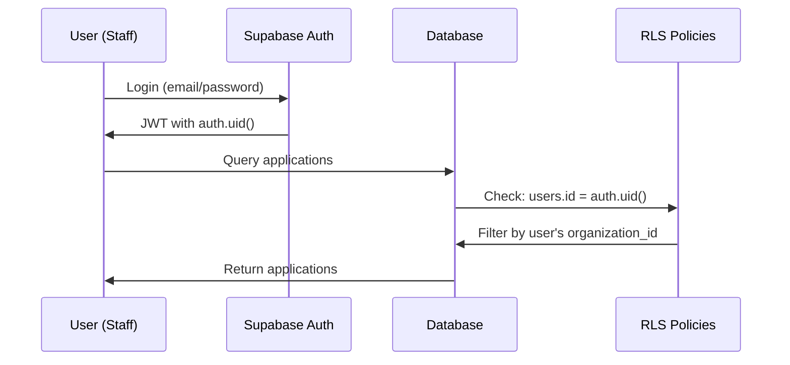
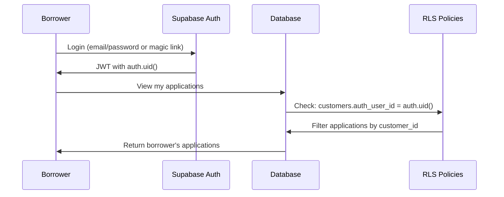

# Supabase Database Architecture Overview

**Project**: Confer LOS (Loan Origination System)
**Database**: PostgreSQL 15.8 (Supabase-managed)
**Last Updated**: 2026-02-10

---

## System Purpose

The Confer LOS database is a comprehensive **multi-tenant loan origination system** designed to manage the complete lifecycle of mortgage applications from initial borrower contact through funding. The system is **URLA 1003 compliant** and includes full **HMDA demographic tracking**.

---

## High-Level Architecture

---

## Multi-Tenancy Model

The system uses **organization-based multi-tenancy**:

- Every core table has an `organization_id` foreign key
- Row-Level Security (RLS) policies enforce data isolation
- Each organization is completely isolated from others
- Shared infrastructure (auth, storage, realtime) is managed by Supabase

**Benefits**:
- Single database for all tenants (cost-effective)
- Strong data isolation via RLS
- Consistent schema across all organizations
- Easy to add new organizations

---

## User Roles & Access Model

### Internal Users (Lender Staff)
These users work within an organization and process loans:

| Role | Access Level | Typical Responsibilities |
|------|-------------|-------------------------|
| `admin` | Full organization access | Manage settings, users, products |
| `loan_officer` | Create/manage applications | Originate loans, communicate with borrowers |
| `processor` | View/update applications | Collect documents, verify information |
| `underwriter` | View/decide applications | Review financials, approve/deny loans |
| `system_admin` | Cross-organization | Confer platform administrators |

**Authentication**: Via `auth.users` with `users.id = auth.uid()`

---

### External Users (Borrowers)
Customers can access the borrower portal to:
- Complete their loan application
- Upload documents
- View application status
- Communicate with loan officer

**Authentication**: Via `auth.users` with `customers.auth_user_id = auth.uid()`

**Key Distinction**:
- Internal users have a record in `public.users`
- Borrowers have a record in `public.customers` with `auth_user_id` linked to `auth.users`

---

## Authentication & Authorization Flow

### Internal User Flow

### Borrower Portal Flow

---

## Row-Level Security (RLS) Strategy

All 27 public schema tables have **RLS enabled**. Key policies include:

### Borrower Portal Policies
- **Customers**: Borrowers can view/update their own customer record
- **Applications**: Borrowers can view applications where they are the primary customer or linked via application_customers
- **Documents**: Borrowers can view/upload documents for their applications only
- **Storage**: Borrowers can only access files in folders matching their auth.uid()

### Internal User Policies
- **Organization isolation**: Users can only access data within their organization
- **Role-based access**: Future enhancement for role-based restrictions
- **System admins**: Can access cross-organization data

**Security Functions**:
- `auth.current_user_organization_id()`: Returns the current user's organization
- `auth.get_user_role()`: Returns the current user's role

---

## Data Model Principles

### 1. Multi-Borrower Support
Applications can have multiple borrowers (e.g., married couple, business partners):
- `application_customers` is a junction table linking applications to customers
- Each link has a `role` (primary_borrower, co_borrower, guarantor)
- Financial data (employment, income, assets, liabilities) is linked to the customer AND application

### 2. URLA 1003 Compliance
The schema mirrors the **Uniform Residential Loan Application**:
- Section I: Borrower Information → `customers`, `residences`
- Section II: Financial Information → `employments`, `incomes`, `assets`, `liabilities`
- Section III: Loan and Property Information → `applications`, `properties`
- Section IV: Declarations → `declarations`
- Section V: Demographics → `demographics`

### 3. Asset/Liability Ownership
Assets and liabilities can be:
- Owned by a single borrower
- Jointly owned by multiple borrowers

This is modeled via ownership junction tables:
- `asset_ownership` (asset_id, customer_id, ownership_percentage)
- `liability_ownership` (liability_id, customer_id, ownership_role)

### 4. Document Management
Documents are stored in Supabase Storage with metadata in the `documents` table:
- `file_path`: Reference to storage bucket
- `document_type`: Categorization (pay_stub, w2, bank_statement, etc.)
- `status`: Review workflow (pending, approved, rejected)
- Linked to applications and optionally to specific customers

### 5. Audit Trail
Every status change is logged in `application_events`:
- Event type (status_change, stage_change, assignment_change)
- From/to values
- User who made the change
- Timestamp and source

---

## Key Workflows

### New Application Workflow
1. **Loan Officer** creates application
   - Selects `loan_product`
   - Creates or selects `property`
   - Creates or selects `primary_customer`
2. **System** creates `application` record (status: draft)
3. **System** creates `application_customers` link (role: primary_borrower)
4. **Loan Officer** invites co-borrowers
   - Creates additional `customers`
   - Creates `application_customers` links
   - Generates `invitation_tokens`
5. **Borrower** completes profile
   - Adds `employments`, `incomes`, `assets`, `liabilities`
   - Completes `declarations`, `demographics`
   - Uploads `documents`
6. **Loan Officer** reviews and submits application
   - Changes status from `draft` to `submitted`
   - System logs `application_events`

### Document Review Workflow
1. **Borrower** uploads document
   - Creates record in `documents` (status: pending)
   - File stored in Supabase Storage bucket
2. **Processor** reviews document
   - Views document
   - Updates status to `approved` or `rejected`
   - If rejected, adds `rejection_reason`
3. **System** logs review
   - Sets `reviewed_by` and `reviewed_at`

---

## Schema Statistics

- **Total Tables**: 27 (public schema)
- **RLS Enabled**: All 27 tables
- **Foreign Keys**: 50+ relationships
- **Indexes**: 30+ performance indexes
- **Storage Buckets**: 2 (documents, borrower-documents)

---

## Technology Stack

- **Database**: PostgreSQL 15.8
- **Platform**: Supabase (managed PostgreSQL)
- **Extensions**:
  - `uuid-ossp`: UUID generation
  - `pgcrypto`: Encryption functions
  - `pgjwt`: JWT handling
  - `pgsodium`: Advanced encryption
  - `pg_graphql`: GraphQL API
- **Auth**: Supabase Auth (built-in)
- **Storage**: Supabase Storage (S3-compatible)
- **Realtime**: Supabase Realtime (WebSocket subscriptions)

---

## Future Enhancements

**Planned Features** (not yet in schema):
- Credit report integration tables
- Automated valuation model (AVM) results
- Third-party service integrations (e.g., Encompass sync)
- Pricing engine configuration
- Compliance checklist tracking
- E-signature integration

---

## Related Documentation

- [Schema Map](./01-schema-map.md) - Visual ER diagram
- [Table Documentation](./tables/) - Detailed table specifications
- [Agent Context](./agent-context.md) - AI-optimized reference

---

*This document is part of the Confer LOS Information as Code (IaC) repository. For questions or updates, submit a PR or contact the development team.*
