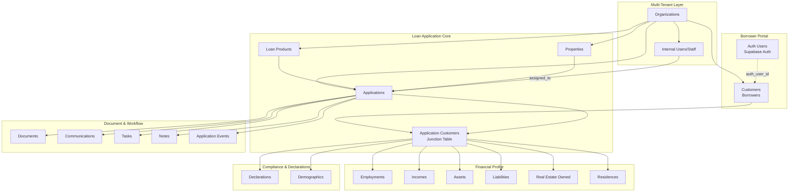
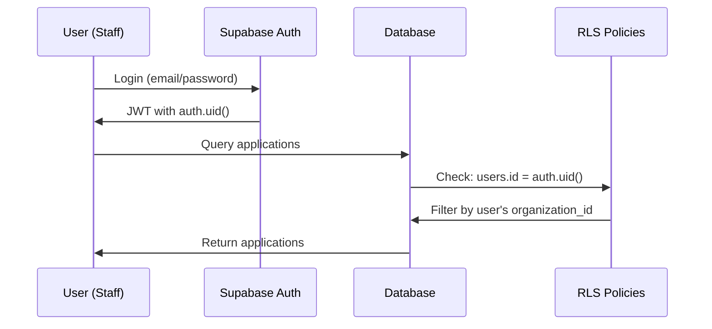
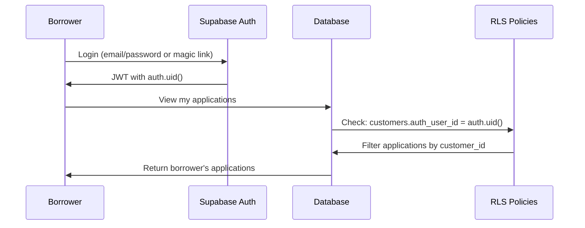

# Supabase Database Architecture Overview

**Project**: Confer LOS (Loan Origination System)
**Database**: PostgreSQL 15.8 (Supabase-managed)
**Last Updated**: 2026-02-12

---

## System Purpose

The Confer LOS database is a comprehensive **multi-tenant loan origination system** designed to manage the complete lifecycle of mortgage applications from initial borrower contact through funding. The system is **URLA 1003 compliant** and includes full **HMDA demographic tracking**.

---

## High-Level Architecture



---

## Multi-Tenancy Model

The system uses **organization-based multi-tenancy**:

- Every core table has an `organization_id` foreign key
- Row-Level Security (RLS) policies enforce data isolation
- Each organization is completely isolated from others
- Shared infrastructure (auth, storage, realtime) is managed by Supabase

**Benefits**:
- Single database for all tenants (cost-effective)
- Strong data isolation via RLS
- Consistent schema across all organizations
- Easy to add new organizations

---

## User Roles & Access Model

### Internal Users (Lender Staff)
These users work within an organization and process loans:

| Role | Access Level | Typical Responsibilities |
|------|-------------|-------------------------|
| `admin` | Full organization access | Manage settings, users, products |
| `loan_officer` | Create/manage applications | Originate loans, communicate with borrowers |
| `processor` | View/update applications | Collect documents, verify information |
| `underwriter` | View/decide applications | Review financials, approve/deny loans |
| `system_admin` | Cross-organization | Confer platform administrators |

**Authentication**: Via `auth.users` with `users.id = auth.uid()`

---

### External Users (Borrowers)
Customers can access the borrower portal to:
- Complete their loan application
- Upload documents
- View application status
- Communicate with loan officer

**Authentication**: Via `auth.users` with `customers.auth_user_id = auth.uid()`

**Key Distinction**:
- Internal users have a record in `public.users`
- Borrowers have a record in `public.customers` with `auth_user_id` linked to `auth.users`

---

## Authentication & Authorization Flow

### Internal User Flow


### Borrower Portal Flow


---

## Row-Level Security (RLS) Strategy

**23 tables** have **RLS enabled** (consents table not yet created). The system deployed 115 comprehensive policies across all tables.

### RLS Helper Functions (5)

All functions are `SECURITY DEFINER` with `SET search_path = public` and `STABLE` volatility:

1. **`get_auth_org_id()`** → uuid
   - Returns staff user's organization_id from users table
   - Returns NULL for borrowers or unauthenticated users

2. **`get_auth_role()`** → text
   - Returns staff user's role (admin, loan_officer, processor, underwriter)
   - Returns NULL for borrowers or unauthenticated users

3. **`auth.is_system_admin()`** → boolean
   - Checks system_admin flag on users table
   - COALESCE to false for safety

4. **`get_auth_customer_ids()`** → SETOF uuid
   - Returns customer IDs linked to auth.uid() via customers.auth_user_id
   - Used for borrower access to customer-scoped data

5. **`get_borrower_application_ids()`** → SETOF uuid
   - Returns application IDs where user is:
     - Primary customer (applications.primary_customer_id)
     - Co-borrower (via application_customers)
     - Anonymous draft creator (via key_information->>'_authUserId')

### Standard Policy Pattern

Each table follows this 5-policy pattern (with variations):

1. **`system_admin_all`** — FOR ALL
   - Check: `auth.is_system_admin()`
   - Bypasses all restrictions for Confer platform admins

2. **`staff_manage`** — FOR ALL
   - Check: `organization_id = get_auth_org_id()` AND role IN ('admin', 'loan_officer', 'processor', 'underwriter')
   - Full CRUD for staff within their organization

3. **`staff_view`** — FOR SELECT
   - Check: `organization_id = get_auth_org_id()`
   - Read-only for any staff role

4. **`borrower_view_own`** — FOR SELECT
   - Check: Scoped to borrower's data (see patterns below)
   - Read access to own data

5. **`borrower_manage_own`** — FOR INSERT/UPDATE
   - Check: Scoped to borrower's data + status restrictions
   - Write access where appropriate (e.g., draft applications only)

### Scoping Patterns by Table Type

**Customer-scoped tables** (residences, employments, incomes, declarations, demographics, gift_funds, real_estate_owned):
```sql
customer_id IN (SELECT get_auth_customer_ids())
```

**Application-scoped tables** (assets, liabilities, documents, communications, application_events):
```sql
application_id IN (SELECT get_borrower_application_ids())
```

**Junction tables** (asset_ownership, liability_ownership):
- Scoped via parent table's application_id

**Staff-only tables** (tasks, notes):
- No borrower policies (staff only)

**Public read tables** (loan_products):
- All authenticated users can SELECT (for rate shopping)

### Special Application Policies

The `applications` table has the most complex policies:

1. **`borrower_view_own_apps`** — FOR SELECT
   - Check: `id IN (SELECT get_borrower_application_ids())`

2. **`borrower_update_own_draft`** — FOR UPDATE
   - Check: `id IN (SELECT get_borrower_application_ids())` AND `status IN ('draft', 'in_progress')`
   - Borrowers can only edit draft/in-progress applications

3. **`anon_create_draft`** — FOR INSERT
   - Anonymous users can create draft applications

4. **`anon_update_own_draft`** — FOR UPDATE
   - Check: `key_information->>'_authUserId' = auth.uid()::text` AND `status = 'draft'`
   - Anonymous draft creators can update their drafts

5. **`anon_view_own_draft`** — FOR SELECT
   - Check: `key_information->>'_authUserId' = auth.uid()::text` AND `status = 'draft'`
   - Anonymous draft creators can view their drafts

### Compliance Rules

**Documents**:
- Borrowers can SELECT, INSERT, UPDATE but NOT DELETE
- Only staff can delete documents (audit compliance)

**Application Events**:
- Borrowers have read-only access (audit trail integrity)
- No UPDATE or DELETE policies for borrowers

**Consents** (table not yet created):
- INSERT + SELECT only (no UPDATE/DELETE)
- Immutability for regulatory compliance

### Performance Indexes

RLS-optimized indexes added:
- `idx_customers_auth_user_id` on customers(auth_user_id)
- `idx_application_customers_customer_id` on application_customers(customer_id)
- `idx_application_customers_application_id` on application_customers(application_id)
- `idx_applications_primary_customer_id` on applications(primary_customer_id)
- `idx_applications_key_info_auth_user` on applications using btree(key_information->>'_authUserId')

---

## Middleware Route Protection

The Next.js middleware enforces route-level access control:

### Staff Routes
- **`/dashboard/*`** — Staff only (loan officers, processors, underwriters, admins)
  - Requires: `public.users` record with valid organization_id
  
- **`/admin/*`** — Admin/System Admin only
  - Requires: role = 'admin' OR system_admin = true

### Borrower Routes
- **`/borrower/*`** — Authenticated borrowers only (NEW)
  - Requires: `public.customers` record with auth_user_id
  
- **`/co-borrower/*`** — Authenticated borrowers, with exceptions (NEW)
  - Public access: `/co-borrower/welcome`, `/co-borrower/verify`
  - Protected: All other co-borrower routes

### Public/Anonymous Routes
- **`/apply/*`** — Partial anonymous access
  - Steps 1-9: Anonymous (draft creation)
  - Step 10+: Authentication required
  - Uses key_information->>'_authUserId' for anonymous tracking

### Implementation Notes
- Middleware runs before RLS policies (first line of defense)
- RLS provides data-level security (second line of defense)
- Defense-in-depth: both layers must authorize access

---

## Data Model Principles

### 1. Multi-Borrower Support
Applications can have multiple borrowers (e.g., married couple, business partners):
- `application_customers` is a junction table linking applications to customers
- Each link has a `role` (primary_borrower, co_borrower, guarantor)
- Financial data (employment, income, assets, liabilities) is linked to the customer AND application

### 2. URLA 1003 Compliance
The schema mirrors the **Uniform Residential Loan Application**:
- Section I: Borrower Information → `customers`, `residences`
- Section II: Financial Information → `employments`, `incomes`, `assets`, `liabilities`
- Section III: Loan and Property Information → `applications`, `properties`
- Section IV: Declarations → `declarations`
- Section V: Demographics → `demographics`

### 3. Asset/Liability Ownership
Assets and liabilities can be:
- Owned by a single borrower
- Jointly owned by multiple borrowers

This is modeled via ownership junction tables:
- `asset_ownership` (asset_id, customer_id, ownership_percentage)
- `liability_ownership` (liability_id, customer_id, ownership_role)

### 4. Document Management
Documents are stored in Supabase Storage with metadata in the `documents` table:
- `file_path`: Reference to storage bucket
- `document_type`: Categorization (pay_stub, w2, bank_statement, etc.)
- `status`: Review workflow (pending, approved, rejected)
- Linked to applications and optionally to specific customers

### 5. Audit Trail
Every status change is logged in `application_events`:
- Event type (status_change, stage_change, assignment_change)
- From/to values
- User who made the change
- Timestamp and source

---

## Key Workflows

### New Application Workflow
1. **Loan Officer** creates application
   - Selects `loan_product`
   - Creates or selects `property`
   - Creates or selects `primary_customer`
2. **System** creates `application` record (status: draft)
3. **System** creates `application_customers` link (role: primary_borrower)
4. **Loan Officer** invites co-borrowers
   - Creates additional `customers`
   - Creates `application_customers` links
   - Generates `invitation_tokens`
5. **Borrower** completes profile
   - Adds `employments`, `incomes`, `assets`, `liabilities`
   - Completes `declarations`, `demographics`
   - Uploads `documents`
6. **Loan Officer** reviews and submits application
   - Changes status from `draft` to `submitted`
   - System logs `application_events`

### Document Review Workflow
1. **Borrower** uploads document
   - Creates record in `documents` (status: pending)
   - File stored in Supabase Storage bucket
2. **Processor** reviews document
   - Views document
   - Updates status to `approved` or `rejected`
   - If rejected, adds `rejection_reason`
3. **System** logs review
   - Sets `reviewed_by` and `reviewed_at`

---

## Schema Statistics

- **Total Tables**: 27 defined (24 created, 3 pending: consents, loan_product_templates, residences_history)
- **RLS Enabled**: 23 tables (consents not yet created)
- **RLS Policies**: 115 policies deployed
- **RLS Helper Functions**: 5 security functions
- **Foreign Keys**: 50+ relationships
- **Indexes**: 35+ performance indexes (including 5 RLS-optimized)
- **Storage Buckets**: 2 (documents, borrower-documents)

---

## Technology Stack

- **Database**: PostgreSQL 15.8
- **Platform**: Supabase (managed PostgreSQL)
- **Extensions**:
  - `uuid-ossp`: UUID generation
  - `pgcrypto`: Encryption functions
  - `pgjwt`: JWT handling
  - `pgsodium`: Advanced encryption
  - `pg_graphql`: GraphQL API
- **Auth**: Supabase Auth (built-in)
- **Storage**: Supabase Storage (S3-compatible)
- **Realtime**: Supabase Realtime (WebSocket subscriptions)

---

## Future Enhancements

**Planned Features** (not yet in schema):
- Credit report integration tables
- Automated valuation model (AVM) results
- Third-party service integrations (e.g., Encompass sync)
- Pricing engine configuration
- Compliance checklist tracking
- E-signature integration

---

## Related Documentation

- [Schema Map](./01-schema-map.md) - Visual ER diagram
- [Table Documentation](./tables/) - Detailed table specifications
- [Agent Context](./agent-context.md) - AI-optimized reference

---

*This document is part of the Confer LOS Information as Code (IaC) repository. For questions or updates, submit a PR or contact the development team.*
