# Supabase Database Schema Map

**Visual Entity Relationship Diagram**
**Last Updated**: 2026-02-10

---

## Complete ER Diagram

This diagram shows all tables in the `public` schema and their relationships. For better readability, the diagram is split into logical sections below.

```mermaid
erDiagram
    %% Core System
    organizations ||--o{ users : "has"
    organizations ||--o{ customers : "has"
    organizations ||--o{ loan_products : "has"
    organizations ||--o{ properties : "has"
    organizations ||--o{ applications : "has"

    %% Application Core
    loan_products ||--o{ applications : "defines product for"
    properties ||--o| applications : "subject property for"
    customers ||--o| applications : "primary customer for"
    users ||--o{ applications : "assigned to"

    applications ||--o{ application_customers : "has borrowers"
    customers ||--o{ application_customers : "linked to applications"
    application_customers ||--o{ invitation_tokens : "has invites"

    %% Employment & Income
    customers ||--o{ employments : "has employment history"
    applications ||--o{ employments : "documented in"
    employments ||--o{ incomes : "generates income"
    customers ||--o{ incomes : "earns"
    applications ||--o{ incomes : "documented in"

    %% Assets
    applications ||--o{ assets : "has assets"
    assets ||--o{ asset_ownership : "owned by"
    customers ||--o{ asset_ownership : "owns assets"
    applications ||--o{ gift_funds : "has gifts"
    customers ||--o{ gift_funds : "receives gifts"
    documents ||--o| gift_funds : "documented by letter"

    %% Liabilities
    applications ||--o{ liabilities : "has debts"
    liabilities ||--o{ liability_ownership : "owned by"
    customers ||--o{ liability_ownership : "owes debts"

    %% Real Estate
    customers ||--o{ real_estate_owned : "owns properties"
    applications ||--o{ real_estate_owned : "documented in"
    customers ||--o{ residences : "lived at"
    applications ||--o{ residences : "documented in"

    %% Declarations & Demographics
    customers ||--o{ declarations : "made declarations"
    applications ||--o{ declarations : "documented in"
    customers ||--o{ demographics : "has demographics"
    applications ||--o{ demographics : "documented in"

    %% Documents & Communication
    applications ||--o{ documents : "has documents"
    customers ||--o{ documents : "uploaded by"
    users ||--o{ documents : "uploaded by staff"
    users ||--o{ documents : "reviewed by"

    applications ||--o{ communications : "has communications"
    customers ||--o{ communications : "communicated with"
    users ||--o{ communications : "initiated by"

    %% Workflow
    applications ||--o{ tasks : "has tasks"
    customers ||--o{ tasks : "relates to"
    users ||--o{ tasks : "assigned to"
    users ||--o{ tasks : "created by"

    applications ||--o{ notes : "has notes"
    customers ||--o{ notes : "relates to"
    users ||--o{ notes : "authored by"

    applications ||--o{ application_events : "has events"
    users ||--o{ application_events : "triggered by"

    %% Table Definitions

    organizations {
        uuid id PK
        text name
        text slug UK
        jsonb settings
        text billing_status
        text stripe_customer_id
        timestamp created_at
        timestamp updated_at
    }

    users {
        uuid id PK "FK to auth.users"
        uuid organization_id FK
        text role
        text first_name
        text last_name
        text email
        text phone
        text avatar_url
        jsonb metadata
        boolean system_admin
        timestamp created_at
        timestamp updated_at
    }

    customers {
        uuid id PK
        uuid organization_id FK
        uuid auth_user_id FK "FK to auth.users"
        uuid portal_user_id
        text customer_type
        text first_name
        text last_name
        text middle_name
        text suffix
        text company_name
        text email
        text phone
        text phone_home
        text phone_cell
        text phone_work
        text phone_work_ext
        jsonb addresses
        text ssn_encrypted
        date date_of_birth
        text citizenship_type
        text marital_status
        integer dependent_count
        text dependent_ages
        jsonb alternate_names
        jsonb key_information
        timestamp created_at
        timestamp updated_at
    }

    loan_products {
        uuid id PK
        uuid organization_id FK
        text name
        text product_type
        text country_code
        text customer_type
        jsonb template
        boolean is_active
        timestamp created_at
        timestamp updated_at
    }

    properties {
        uuid id PK
        uuid organization_id FK
        jsonb address
        text country_code
        text property_type
        integer year_built
        integer square_feet
        integer bedrooms
        numeric bathrooms
        numeric appraised_value
        numeric purchase_price
        jsonb metadata
        timestamp created_at
        timestamp updated_at
    }

    applications {
        uuid id PK
        uuid organization_id FK
        uuid property_id FK
        uuid loan_product_id FK
        uuid primary_customer_id FK
        uuid assigned_to FK
        text title
        text application_number UK
        numeric loan_amount
        text occupancy_type
        text status
        text stage
        jsonb key_information
        jsonb decision_result
        timestamp created_at
        timestamp updated_at
        timestamp submitted_at
        timestamp funded_at
    }

    application_customers {
        uuid id PK
        uuid application_id FK
        uuid customer_id FK
        uuid organization_id FK
        uuid created_by FK
        text role
        integer sequence
        numeric ownership_percentage
        boolean will_occupy_property
        boolean will_be_on_title
        text credit_type
        text invite_status
        timestamp invited_at
        timestamp accepted_at
        boolean econsent_given
        timestamp econsent_given_at
        text econsent_ip_address
        timestamp created_at
    }

    invitation_tokens {
        uuid id PK
        uuid application_customer_id FK
        text token UK
        timestamp expires_at
        timestamp used_at
        timestamp created_at
        timestamp updated_at
    }

    employments {
        uuid id PK
        uuid organization_id FK
        uuid customer_id FK
        uuid application_id FK
        text employment_type
        boolean is_current
        text employer_name
        text employer_phone
        text employer_street_address
        text employer_unit
        text employer_city
        text employer_state
        text employer_zip_code
        text position_title
        date start_date
        date end_date
        integer years_in_profession
        integer months_in_profession
        boolean is_self_employed
        text ownership_percentage
        numeric self_employed_monthly_income
        boolean is_employed_by_family
        boolean is_party_to_transaction
        timestamp created_at
        timestamp updated_at
    }

    incomes {
        uuid id PK
        uuid organization_id FK
        uuid customer_id FK
        uuid application_id FK
        uuid employment_id FK
        text income_source
        text income_type
        numeric monthly_amount
        boolean include_in_qualification
        text verification_status
        numeric verified_amount
        text description
        timestamp created_at
        timestamp updated_at
    }

    assets {
        uuid id PK
        uuid organization_id FK
        uuid application_id FK
        text asset_category
        text asset_type
        text institution_name
        text account_number
        numeric cash_or_market_value
        boolean is_gift_or_grant
        text gift_type
        text gift_source
        text gift_deposited_status
        text verification_status
        numeric verified_value
        text description
        timestamp created_at
        timestamp updated_at
    }

    asset_ownership {
        uuid asset_id FK
        uuid customer_id FK
        numeric ownership_percentage
        text ownership_role
    }

    gift_funds {
        uuid id PK
        uuid organization_id FK
        uuid application_id FK
        uuid customer_id FK
        uuid gift_letter_document_id FK
        text donor_name
        text donor_relationship
        numeric gift_amount
        date gift_date
        boolean gift_letter_received
        boolean deposited
        date deposit_date
        text deposit_account
        timestamp created_at
        timestamp updated_at
    }

    liabilities {
        uuid id PK
        uuid organization_id FK
        uuid application_id FK
        text liability_type
        text creditor_name
        text account_number
        numeric unpaid_balance
        numeric monthly_payment
        integer months_remaining
        boolean to_be_paid_off_at_closing
        boolean will_be_subordinated
        boolean exclude_from_dti
        text exclusion_reason
        text description
        timestamp created_at
        timestamp updated_at
    }

    liability_ownership {
        uuid liability_id FK
        uuid customer_id FK
        text ownership_role
        boolean is_excluded
        text exclusion_reason
    }

    real_estate_owned {
        uuid id PK
        uuid organization_id FK
        uuid customer_id FK
        uuid application_id FK
        text property_street_address
        text property_unit
        text property_city
        text property_state
        text property_zip_code
        text property_country
        text property_type
        numeric property_value
        text property_status
        text intended_occupancy
        numeric monthly_insurance_taxes_hoa
        boolean has_mortgage
        text mortgage_creditor_name
        text mortgage_account_number
        numeric mortgage_monthly_payment
        numeric mortgage_unpaid_balance
        boolean mortgage_to_be_paid_off
        text mortgage_type
        boolean has_heloc
        numeric heloc_credit_limit
        numeric heloc_balance
        boolean is_rental
        numeric monthly_rental_income
        numeric net_rental_income
        timestamp created_at
        timestamp updated_at
    }

    residences {
        uuid id PK
        uuid organization_id FK
        uuid customer_id FK
        uuid application_id FK
        text residence_type
        text street_address
        text unit_number
        text city
        text state
        text zip_code
        text country
        date move_in_date
        date move_out_date
        integer years_at_address
        integer months_at_address
        text housing_type
        numeric monthly_rent
        boolean is_mailing_address
        timestamp created_at
        timestamp updated_at
    }

    declarations {
        uuid id PK
        uuid organization_id FK
        uuid customer_id FK
        uuid application_id FK
        boolean will_occupy_as_primary
        boolean have_ownership_interest_last_3_years
        text property_type_if_owned
        text title_holding_method
        boolean is_family_relationship_with_seller
        boolean have_undisclosed_borrowed_funds
        numeric undisclosed_borrowed_amount
        boolean have_undisclosed_mortgage_application
        boolean have_undisclosed_credit_application
        boolean have_priority_liens
        boolean have_cosigned_obligations
        boolean have_outstanding_judgments
        boolean are_delinquent_on_federal_debt
        boolean is_party_to_lawsuit
        boolean have_deed_in_lieu
        boolean have_short_sale
        boolean have_foreclosure
        boolean have_bankruptcy
        jsonb bankruptcy_chapter
        jsonb explanations
        timestamp created_at
        timestamp updated_at
    }

    demographics {
        uuid id PK
        uuid organization_id FK
        uuid customer_id FK
        uuid application_id FK
        text collection_method
        boolean declined_to_provide
        jsonb ethnicity
        text ethnicity_other_description
        jsonb race
        text race_tribe_name
        text race_other_asian
        text race_other_pacific_islander
        text sex
        jsonb observed_ethnicity
        jsonb observed_race
        text observed_sex
        timestamp created_at
        timestamp updated_at
    }

    documents {
        uuid id PK
        uuid organization_id FK
        uuid application_id FK
        uuid customer_id FK
        uuid uploaded_by FK
        uuid reviewed_by FK
        text document_type
        text file_name
        text file_path
        integer file_size
        text mime_type
        text status
        timestamp reviewed_at
        text rejection_reason
        date period_start
        date period_end
        integer year
        timestamp created_at
        timestamp updated_at
    }

    communications {
        uuid id PK
        uuid organization_id FK
        uuid application_id FK
        uuid customer_id FK
        uuid initiated_by FK
        text communication_type
        text direction
        text channel
        text subject
        text content
        text external_id
        jsonb metadata
        timestamp created_at
    }

    tasks {
        uuid id PK
        uuid organization_id FK
        uuid application_id FK
        uuid customer_id FK
        uuid assignee_id FK
        uuid created_by FK
        text title
        text description
        text status
        text priority
        date due_date
        timestamp completed_at
        timestamp created_at
    }

    notes {
        uuid id PK
        uuid organization_id FK
        uuid application_id FK
        uuid customer_id FK
        uuid author_id FK
        text content
        timestamp created_at
    }

    application_events {
        uuid id PK
        uuid application_id FK
        uuid organization_id FK
        uuid user_id FK
        text event_type
        text from_status
        text to_status
        text from_stage
        text to_stage
        text source
        jsonb metadata
        timestamp created_at
    }
```



---

## Diagram Legend

- **PK**: Primary Key
- **FK**: Foreign Key
- **UK**: Unique Key
- **||--o{**: One-to-many relationship
- **||--o|**: One-to-zero-or-one relationship
- **||--||**: One-to-one relationship

---

## Table Categories

### 🏢 Core System (2 tables)
- `organizations` - Multi-tenant organizations
- `users` - Internal staff users

### 👥 Customer Management (3 tables)
- `customers` - Borrower profiles
- `application_customers` - Application-borrower junction
- `invitation_tokens` - Co-borrower invitations

### 🏠 Loan Application Core (4 tables)
- `loan_products` - Product definitions
- `properties` - Subject properties
- `applications` - Loan applications
- `application_events` - Audit trail

### 💼 Employment & Income (2 tables)
- `employments` - Employment history
- `incomes` - Income sources

### 💰 Assets & Liabilities (5 tables)
- `assets` - Financial assets
- `asset_ownership` - Asset ownership junction
- `gift_funds` - Gift tracking
- `liabilities` - Debts
- `liability_ownership` - Liability ownership junction

### 🏡 Real Estate (2 tables)
- `real_estate_owned` - Borrower-owned properties
- `residences` - Residence history

### 📋 Compliance (2 tables)
- `declarations` - URLA declarations
- `demographics` - HMDA demographics

### 📄 Documents & Communication (2 tables)
- `documents` - Document management
- `communications` - Communication log

### ✅ Workflow Management (2 tables)
- `tasks` - Task tracking
- `notes` - Notes and comments

---

## Common Query Patterns

### Get all borrowers for an application
```sql
SELECT c.*
FROM customers c
JOIN application_customers ac ON c.id = ac.customer_id
WHERE ac.application_id = 'app-uuid-here'
ORDER BY ac.sequence;
```

### Get total monthly income for a customer
```sql
SELECT
  customer_id,
  SUM(monthly_amount) as total_income
FROM incomes
WHERE customer_id = 'cust-uuid-here'
  AND application_id = 'app-uuid-here'
  AND include_in_qualification = true
GROUP BY customer_id;
```

### Get all assets owned by a customer
```sql
SELECT a.*, ao.ownership_percentage
FROM assets a
JOIN asset_ownership ao ON a.id = ao.asset_id
WHERE ao.customer_id = 'cust-uuid-here'
  AND a.application_id = 'app-uuid-here';
```

### Get application timeline
```sql
SELECT
  event_type,
  from_status,
  to_status,
  u.first_name || ' ' || u.last_name as changed_by,
  created_at
FROM application_events ae
LEFT JOIN users u ON ae.user_id = u.id
WHERE ae.application_id = 'app-uuid-here'
ORDER BY created_at DESC;
```

---

## Next Steps

For detailed table specifications and business logic, see:
- [Table Documentation](./tables/) - Individual table documentation by category
- [Agent Context](./agent-context.md) - Token-optimized AI reference

---

*This diagram is auto-generated from the schema. Last updated: 2026-02-10*
