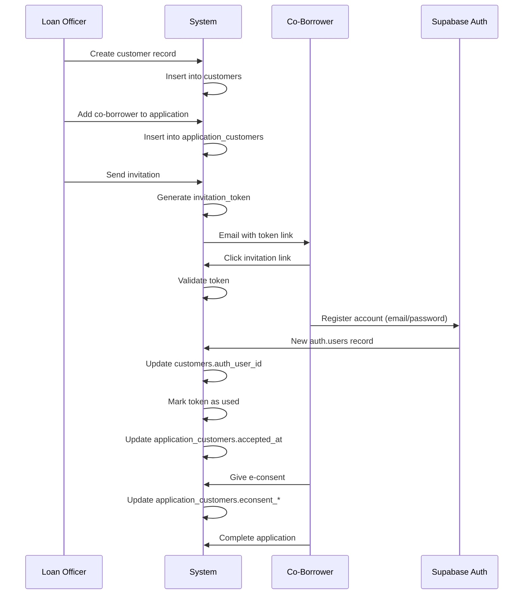

# Customers & Borrower Portal Tables

**Category**: Customer Management
**Tables**: `customers`, `application_customers`, `invitation_tokens`
**Purpose**: Manage borrower profiles and link them to loan applications

---

## Table: `customers`

**Purpose**: Stores borrower/applicant profiles. Customers can be individuals or business entities applying for loans. Customers may access the borrower portal via `auth_user_id`.

### Columns

| Column | Type | Nullable | Default | Description |
|--------|------|----------|---------|-------------|
| `id` | uuid | NO | `gen_random_uuid()` | Primary key |
| `organization_id` | uuid | YES | NULL | FK to `organizations` |
| `customer_type` | text | NO | - | "individual" or "business" |
| `first_name` | text | YES | NULL | First name (individual) |
| `last_name` | text | YES | NULL | Last name (individual) |
| `middle_name` | text | YES | NULL | Middle name |
| `suffix` | text | YES | NULL | Suffix (Jr., Sr., III, etc.) |
| `company_name` | text | YES | NULL | Company name (business) |
| `email` | text | YES | NULL | Primary email address |
| `phone` | text | YES | NULL | Primary phone number |
| `phone_home` | text | YES | NULL | Home phone |
| `phone_cell` | text | YES | NULL | Cell phone |
| `phone_work` | text | YES | NULL | Work phone |
| `phone_work_ext` | text | YES | NULL | Work phone extension |
| `addresses` | jsonb | YES | NULL | Structured address history |
| `ssn_encrypted` | text | YES | NULL | Encrypted SSN/TIN |
| `date_of_birth` | date | YES | NULL | Date of birth |
| `citizenship_type` | text | YES | NULL | US Citizen, Permanent Resident, Non-Permanent Resident |
| `marital_status` | text | YES | NULL | Single, Married, Separated, Unmarried |
| `dependent_count` | integer | YES | `0` | Number of dependents |
| `dependent_ages` | text | YES | NULL | Ages of dependents (comma-separated) |
| `alternate_names` | jsonb | YES | NULL | Previous/alternate names |
| `key_information` | jsonb | YES | NULL | Additional flexible data |
| `portal_user_id` | uuid | YES | NULL | Legacy portal user ID (deprecated) |
| `auth_user_id` | uuid | YES | NULL | **FK to auth.users** - for borrower portal access |
| `created_at` | timestamp | NO | `now()` | Creation timestamp |
| `updated_at` | timestamp | NO | `now()` | Last update timestamp |

### Constraints

- **PK**: `id`
- **FK**: `organization_id` → `organizations(id)`
- **FK**: `auth_user_id` → `auth.users(id)` ON DELETE SET NULL

### Indexes

- `customers_pkey` on `id`
- `customers_organization_id_idx` on `organization_id`
- `customers_auth_user_id_idx` on `auth_user_id` (for portal lookups)

### RLS Policies

1. **"Borrowers can view own customer record"**
   - Operation: `SELECT`
   - Check: `auth_user_id = auth.uid()`
   - Allows borrowers to view their own profile

2. **"Borrowers can update own customer record"**
   - Operation: `UPDATE`
   - Check: `auth_user_id = auth.uid()`
   - Allows borrowers to update their profile

3. **"Users can create own customer record"** (for portal registration)
   - Operation: `INSERT`
   - Check: `auth_user_id = auth.uid()`

4. **"Internal users can view organization customers"** (planned)
   - Operation: `SELECT`
   - Check: `organization_id = auth.current_user_organization_id()`

### JSONB Structures

**`addresses`** (array of address objects):
```json
[
  {
    "type": "current",
    "street": "123 Main St",
    "unit": "Apt 4B",
    "city": "San Francisco",
    "state": "CA",
    "zip_code": "94102",
    "country": "US",
    "is_mailing": true
  },
  {
    "type": "previous",
    "street": "456 Oak Ave",
    "city": "Los Angeles",
    "state": "CA",
    "zip_code": "90001",
    "country": "US",
    "years": 3,
    "months": 6
  }
]
```

**`alternate_names`** (array of name objects):
```json
[
  {
    "first_name": "Jane",
    "last_name": "Smith",
    "reason": "maiden_name"
  }
]
```

### Usage Patterns

**Create individual customer**:
```sql
INSERT INTO customers (
  organization_id, customer_type,
  first_name, last_name, email, phone,
  date_of_birth, ssn_encrypted
) VALUES (
  'org-uuid',
  'individual',
  'John', 'Doe',
  'john.doe@example.com',
  '555-123-4567',
  '1985-06-15',
  pgp_sym_encrypt('123-45-6789', 'encryption-key')
);
```

**Link customer to portal auth**:
```sql
UPDATE customers
SET
  auth_user_id = 'auth-user-uuid',
  updated_at = now()
WHERE id = 'customer-uuid';
```

**Get customer by portal user**:
```sql
SELECT *
FROM customers
WHERE auth_user_id = auth.uid();
```

### Business Logic

- **SSN Encryption**: Use `pgp_sym_encrypt()` for SSN storage, never plain text
- **Customer Type**:
  - `individual`: Use first_name, last_name, date_of_birth
  - `business`: Use company_name, may have authorized_signer info in key_information
- **Portal Access**: Only customers with `auth_user_id` can log into borrower portal
- **Duplicate Detection**: Check email, phone, and SSN before creating new customer
- **PII Handling**: SSN, DOB are sensitive - extra logging/access controls required

---

## Table: `application_customers`

**Purpose**: Junction table linking customers to applications. Supports multi-borrower scenarios (e.g., married couple, business partners). Tracks borrower role, ownership, and invitation status.

### Columns

| Column | Type | Nullable | Default | Description |
|--------|------|----------|---------|-------------|
| `id` | uuid | NO | `gen_random_uuid()` | Primary key |
| `application_id` | uuid | NO | - | FK to `applications` |
| `customer_id` | uuid | NO | - | FK to `customers` |
| `organization_id` | uuid | YES | NULL | FK to `organizations` (denormalized) |
| `created_by` | uuid | YES | NULL | FK to `users` who created the link |
| `role` | text | NO | - | Borrower role (see values below) |
| `sequence` | integer | YES | NULL | Display order (1, 2, 3...) |
| `ownership_percentage` | numeric | YES | NULL | % ownership in property |
| `will_occupy_property` | boolean | YES | `true` | Will borrower live in property |
| `will_be_on_title` | boolean | YES | `true` | Will borrower be on title |
| `credit_type` | text | YES | `'individual'` | "individual" or "joint" credit |
| `invite_status` | text | YES | `'pending'` | Invitation workflow status |
| `invited_at` | timestamp | YES | NULL | When invitation was sent |
| `accepted_at` | timestamp | YES | NULL | When borrower accepted invitation |
| `econsent_given` | boolean | YES | `false` | Has borrower consented to electronic disclosures |
| `econsent_given_at` | timestamp | YES | NULL | When e-consent was given |
| `econsent_ip_address` | text | YES | NULL | IP address of e-consent |
| `created_at` | timestamp | NO | `now()` | Creation timestamp |

### Constraints

- **PK**: `id`
- **FK**: `application_id` → `applications(id)` ON DELETE CASCADE
- **FK**: `customer_id` → `customers(id)` ON DELETE CASCADE
- **FK**: `organization_id` → `organizations(id)`
- **FK**: `created_by` → `users(id)`

### Indexes

- `application_customers_pkey` on `id`
- `application_customers_application_id_idx` on `application_id`
- `application_customers_customer_id_idx` on `customer_id`

### Borrower Roles

Common values for `role`:

| Role | Description | Typical Use |
|------|-------------|-------------|
| `primary_borrower` | Main applicant | First borrower on application |
| `co_borrower` | Joint applicant | Spouse, partner, co-applicant |
| `guarantor` | Non-borrowing guarantor | Parent guaranteeing child's loan |
| `seller` | Property seller | For seller financing |
| `authorized_signer` | Can sign on behalf of business | For business loans |

### Invite Status Values

| Status | Description |
|--------|-------------|
| `pending` | Invitation created, not sent |
| `sent` | Invitation sent to borrower email |
| `accepted` | Borrower accepted and created portal account |
| `declined` | Borrower declined invitation |
| `expired` | Invitation token expired |

### Usage Patterns

**Add primary borrower to application**:
```sql
INSERT INTO application_customers (
  application_id, customer_id, organization_id, created_by,
  role, sequence, credit_type, invite_status
) VALUES (
  'app-uuid', 'customer-uuid', 'org-uuid', auth.uid(),
  'primary_borrower', 1, 'individual', 'accepted'
);
```

**Invite co-borrower**:
```sql
INSERT INTO application_customers (
  application_id, customer_id, organization_id, created_by,
  role, sequence, will_occupy_property, will_be_on_title,
  invite_status, invited_at
) VALUES (
  'app-uuid', 'customer-uuid', 'org-uuid', auth.uid(),
  'co_borrower', 2, true, true,
  'sent', now()
);
```

**Mark e-consent given**:
```sql
UPDATE application_customers
SET
  econsent_given = true,
  econsent_given_at = now(),
  econsent_ip_address = '192.168.1.1'
WHERE id = 'app-cust-uuid';
```

### Business Logic

- **Sequence**: Determines display order (Borrower 1, Borrower 2, etc.)
- **Credit Type**: Affects how credit report is pulled
  - `individual`: Separate credit report per borrower
  - `joint`: Combined credit report
- **E-Consent**: Required before electronic disclosures can be sent
- **Ownership**: Sum of all borrowers' `ownership_percentage` should equal 100%
- **Cascade Delete**: Removing application deletes all links

---

## Table: `invitation_tokens`

**Purpose**: Secure tokens for inviting co-borrowers to join the application. Tokens are one-time use and expire after a set period.

### Columns

| Column | Type | Nullable | Default | Description |
|--------|------|----------|---------|-------------|
| `id` | uuid | NO | `gen_random_uuid()` | Primary key |
| `application_customer_id` | uuid | NO | - | FK to `application_customers` |
| `token` | text | NO | - | Secure random token (URL-safe) |
| `expires_at` | timestamp | NO | - | Expiration timestamp |
| `used_at` | timestamp | YES | NULL | When token was used |
| `created_at` | timestamp | YES | `now()` | Creation timestamp |
| `updated_at` | timestamp | YES | `now()` | Last update timestamp |

### Constraints

- **PK**: `id`
- **FK**: `application_customer_id` → `application_customers(id)` ON DELETE CASCADE
- **UNIQUE**: `token`

### Indexes

- `invitation_tokens_pkey` on `id`
- `invitation_tokens_token_idx` on `token` (for fast lookup)
- `invitation_tokens_app_cust_idx` on `application_customer_id`

### Usage Patterns

**Generate invitation token**:
```sql
INSERT INTO invitation_tokens (
  application_customer_id,
  token,
  expires_at
) VALUES (
  'app-cust-uuid',
  encode(gen_random_bytes(32), 'base64'),
  now() + interval '7 days'
);
```

**Validate and consume token**:
```sql
UPDATE invitation_tokens
SET used_at = now()
WHERE token = 'token-here'
  AND expires_at > now()
  AND used_at IS NULL
RETURNING application_customer_id;
```

**Check if token is valid**:
```sql
SELECT ac.*
FROM invitation_tokens it
JOIN application_customers ac ON it.application_customer_id = ac.id
WHERE it.token = 'token-here'
  AND it.expires_at > now()
  AND it.used_at IS NULL;
```

### Business Logic

- **Token Format**: Base64-encoded random bytes (URL-safe)
- **Expiration**: Typically 7 days from creation
- **One-Time Use**: `used_at` is set when token is consumed
- **Cascade Delete**: Deleting application_customer deletes the token
- **Security**: Never send token in email subject line or logs

---

## Borrower Portal Flow



---

## Common Queries

### Get all borrowers for an application
```sql
SELECT
  c.*,
  ac.role,
  ac.sequence,
  ac.invite_status,
  ac.econsent_given
FROM customers c
JOIN application_customers ac ON c.id = ac.customer_id
WHERE ac.application_id = 'app-uuid'
ORDER BY ac.sequence;
```

### Get borrower's applications
```sql
SELECT a.*
FROM applications a
JOIN application_customers ac ON a.id = ac.application_id
WHERE ac.customer_id = (
  SELECT id FROM customers WHERE auth_user_id = auth.uid()
);
```

### Check if all borrowers have given e-consent
```sql
SELECT
  BOOL_AND(econsent_given) as all_consented
FROM application_customers
WHERE application_id = 'app-uuid';
```

---

*See also: [auth-and-users.md](./auth-and-users.md) for internal user authentication*
