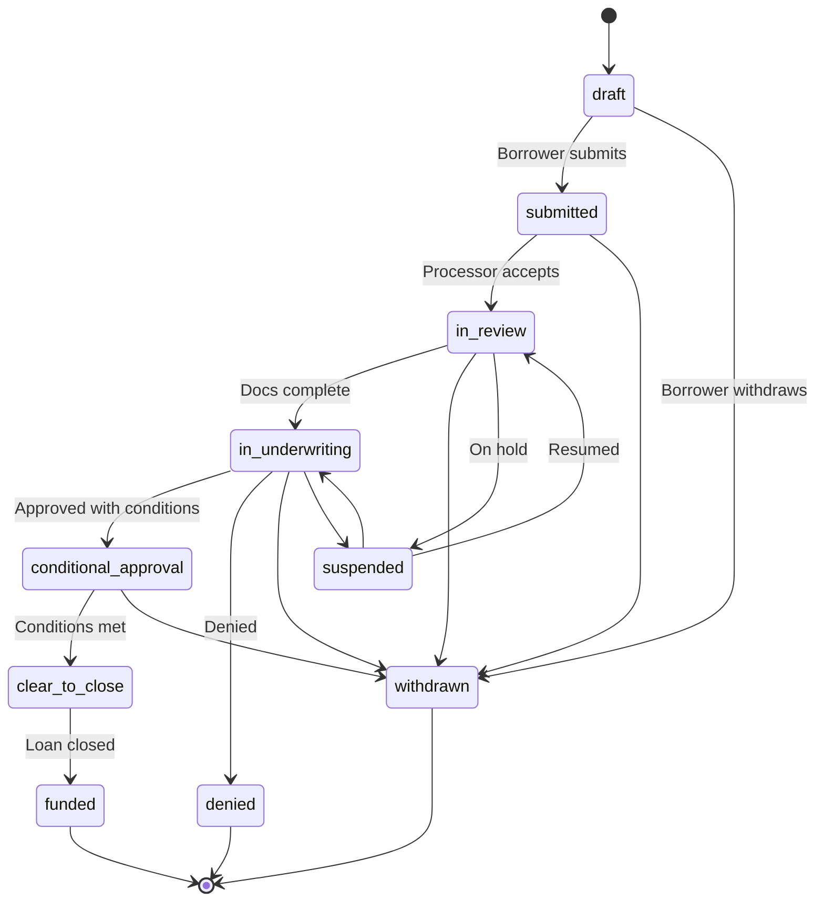

# Loan Applications Tables

**Category**: Loan Application Core
**Tables**: `loan_products`, `properties`, `applications`, `application_events`
**Last Updated**: 2026-02-12

---

## Table: `loan_products`

**Purpose**: Product templates defining loan types offered by the organization (30-year fixed, ARM, FHA, VA, etc.)

### Key Columns
- `id`, `organization_id`, `name`, `product_type`
- `country_code` - US, CA, etc.
- `customer_type` - consumer, commercial
- `template` (jsonb) - Product configuration, pricing rules, qualification criteria
- `is_active` - Whether product is available for new applications

### Example Template Structure
```json
{
  "interest_rate": 6.5,
  "term_months": 360,
  "amortization_type": "fixed",
  "min_credit_score": 620,
  "max_ltv": 80,
  "product_features": ["no_prepayment_penalty", "assumable"]
}
```

### Business Logic
- Each organization can have multiple loan products
- Template structure is flexible (jsonb) to accommodate various product types
- Product selection drives application requirements and workflow

### RLS Policies

**4 policies enabled**:

1. **`system_admin_all`** — FOR ALL
   - Check: `auth.is_system_admin()`

2. **`staff_manage`** — FOR ALL
   - Check: `organization_id = get_auth_org_id()` AND `get_auth_role() IN ('admin', 'loan_officer', 'processor', 'underwriter')`

3. **`staff_view`** — FOR SELECT
   - Check: `organization_id = get_auth_org_id()`

4. **`authenticated_view`** — FOR SELECT
   - Check: `auth.uid() IS NOT NULL`
   - All authenticated users (including borrowers) can view loan products for rate shopping

---

## Table: `properties`

**Purpose**: Subject properties for loan applications. Stores property address and characteristics.

### Key Columns
- `id`, `organization_id`
- `address` (jsonb) - Structured address
- `country_code`, `property_type`
- `year_built`, `square_feet`, `bedrooms`, `bathrooms`
- `appraised_value`, `purchase_price`
- `metadata` (jsonb) - Additional property details (parcel #, HOA, etc.)

### Address Structure
```json
{
  "street": "123 Main St",
  "unit": "Suite 100",
  "city": "San Francisco",
  "state": "CA",
  "zip_code": "94102",
  "county": "San Francisco",
  "country": "US"
}
```

### Property Types
- Single Family, Condo, Townhouse, Multi-Family (2-4 units), Manufactured/Mobile Home

### RLS Policies

**5 policies enabled**:

1. **`system_admin_all`** — FOR ALL
   - Check: `auth.is_system_admin()`

2. **`staff_manage`** — FOR ALL
   - Check: `organization_id = get_auth_org_id()` AND `get_auth_role() IN ('admin', 'loan_officer', 'processor', 'underwriter')`

3. **`staff_view`** — FOR SELECT
   - Check: `organization_id = get_auth_org_id()`

4. **`borrower_view_own`** — FOR SELECT
   - Check: `id IN (SELECT property_id FROM applications WHERE id IN (SELECT get_borrower_application_ids()))`
   - Borrowers can view properties associated with their applications

5. **`borrower_update_own`** — FOR UPDATE
   - Check: `id IN (SELECT property_id FROM applications WHERE id IN (SELECT get_borrower_application_ids()) AND status IN ('draft', 'in_progress'))`
   - Borrowers can update property details for draft applications

---

## Table: `applications`

**Purpose**: Core application entity. Central hub connecting customer, property, loan product, and all application data.

### Key Columns

| Column | Type | Description |
|--------|------|-------------|
| `id` | uuid | Primary key |
| `organization_id` | uuid | FK to organizations |
| `property_id` | uuid | FK to properties (subject property) |
| `loan_product_id` | uuid | FK to loan_products |
| `primary_customer_id` | uuid | FK to customers (primary borrower) |
| `assigned_to` | uuid | FK to users (loan officer) — **deprecated, use loan_officer_id** |
| `title` | text | Application title/name |
| `application_number` | text | Unique identifier (UNIQUE) |
| `loan_amount` | numeric | Requested loan amount |
| `occupancy_type` | text | Primary Residence, Second Home, Investment |
| `status` | text | Workflow status (see below) |
| `stage` | text | Workflow stage enum (see below) — **or use pipeline_stage_id** |
| `key_information` | jsonb | Flexible application data |
| `decision_result` | jsonb | Underwriting decision details |
| **Phase 5B Columns** | | |
| `pipeline_stage_id` | uuid | **Phase 5B** — FK to custom pipeline_stages (alternative to stage enum) |
| `stage_entered_at` | timestamp | **Phase 5B** — When current stage was entered |
| `lead_id` | uuid | **Phase 5B** — FK to leads (if converted from lead) |
| `estimated_closing_date` | timestamp | **Phase 5B** — Target closing date |
| `loan_officer_id` | uuid | **Phase 5B** — FK to users (primary loan officer) |
| `processor_id` | uuid | **Phase 5B** — FK to users (assigned processor) |
| `source` | text | **Phase 5B** — Application source (lo_created, borrower_portal, lead_conversion, api) |
| **Processing Tracking** | | |
| `processing_status` | text | **Phase 5B** — not_started, in_progress, file_complete, submitted_to_uw, suspended |
| `processing_started_at` | timestamp | **Phase 5B** — When processing began |
| `submitted_to_uw_at` | timestamp | **Phase 5B** — When submitted to underwriting |
| `submitted_to_uw_by` | uuid | **Phase 5B** — FK to users who submitted to UW |
| **Credit Scores** | | |
| `credit_score_experian` | integer | **Phase 5B** — Experian credit score |
| `credit_score_equifax` | integer | **Phase 5B** — Equifax credit score |
| `credit_score_transunion` | integer | **Phase 5B** — TransUnion credit score |
| `representative_credit_score` | integer | **Phase 5B** — Representative credit score (middle of 3) |
| `credit_pulled_at` | timestamp | **Phase 5B** — When credit was pulled |
| **Appraisal** | | |
| `appraisal_value` | numeric | **Phase 5B** — Appraised property value |
| `appraisal_date` | timestamp | **Phase 5B** — Appraisal completion date |
| **Underwriting Decision** | | |
| `uw_decision` | text | **Phase 5B** — approved, approved_with_conditions, suspended, denied |
| `uw_decision_date` | timestamp | **Phase 5B** — Decision date |
| `uw_decision_by` | uuid | **Phase 5B** — FK to users (underwriter) |
| **Rate Lock** | | |
| `rate_lock_status` | text | **Phase 5B** — locked, expired, extended, not_locked |
| `rate_lock_expiration` | timestamp | **Phase 5B** — Rate lock expiration date |
| `rate_lock_rate` | numeric | **Phase 5B** — Locked interest rate |
| `rate_lock_date` | timestamp | **Phase 5B** — When rate was locked |
| **AUS (Automated Underwriting)** | | |
| `aus_recommendation` | text | **Phase 5B** — AUS recommendation |
| `aus_findings` | jsonb | **Phase 5B** — AUS findings details |
| `aus_type` | text | **Phase 5B** — du (Desktop Underwriter), lp (Loan Prospector), manual |
| `aus_run_at` | timestamp | **Phase 5B** — When AUS was run |
| **Calculated Ratios** | | |
| `ltv` | numeric | **Phase 5B** — Loan-to-value ratio (%) |
| `dti` | numeric | **Phase 5B** — Debt-to-income ratio (%) |
| **Other** | | |
| `target_closing_date` | timestamp | **Phase 5B** — Target closing date |
| `submission_notes` | text | **Phase 5B** — Notes for submission to UW |
| `created_at`, `updated_at` | timestamp | Timestamps |
| `submitted_at`, `funded_at` | timestamp | Milestone timestamps |

### Application Status Values

| Status | Description |
|--------|-------------|
| `draft` | Being completed by borrower/LO |
| `submitted` | Submitted for processing |
| `in_review` | Being reviewed by processor |
| `in_underwriting` | With underwriter |
| `conditional_approval` | Approved with conditions |
| `clear_to_close` | All conditions met |
| `funded` | Loan funded |
| `denied` | Application denied |
| `withdrawn` | Withdrawn by borrower |
| `suspended` | On hold |

### Application Stage Values

| Stage | Description |
|-------|-------------|
| `application` | Initial application entry |
| `processing` | Document collection, verification |
| `underwriting` | Credit review, risk assessment |
| `closing` | Final approval, closing preparation |
| `funded` | Loan closed and funded |

**Phase 5B Update**: Applications can now use **custom stages** via `pipeline_stage_id` (FK to `pipeline_stages` table). This allows organizations to define their own workflow stages with custom names, colors, and SLA deadlines. The `stage` enum is still supported for backward compatibility.

**Stage vs. Pipeline Stage**:
- `stage` (enum) — Default workflow stages (backward compatible)
- `pipeline_stage_id` (FK) — Custom stages per organization (new in Phase 5B)
- Applications can use **either** approach, not both
- `stage_entered_at` tracks when the current stage was entered (for SLA tracking)

### Processing Status Values (Phase 5B)

| Status | Description |
|--------|-------------|
| `not_started` | Processing has not begun |
| `in_progress` | Actively processing (collecting docs, verifying) |
| `file_complete` | All documents collected and verified |
| `submitted_to_uw` | Submitted to underwriting |
| `suspended` | Processing suspended/on hold |

### Source Values (Phase 5B)

| Source | Description |
|--------|-------------|
| `lo_created` | Created by loan officer in LO Portal |
| `borrower_portal` | Created by borrower in borrower portal |
| `lead_conversion` | Converted from a lead |
| `api` | Created via API |

### RLS Policies

**8 policies enabled** (most complex table):

1. **`system_admin_all`** — FOR ALL
   - Check: `auth.is_system_admin()`

2. **`staff_manage`** — FOR ALL
   - Check: `organization_id = get_auth_org_id()` AND `get_auth_role() IN ('admin', 'loan_officer', 'processor', 'underwriter')`

3. **`staff_view`** — FOR SELECT
   - Check: `organization_id = get_auth_org_id()`

4. **`borrower_view_own_apps`** — FOR SELECT
   - Check: `id IN (SELECT get_borrower_application_ids())`
   - Borrowers can view applications where they are primary customer, co-borrower, or draft creator

5. **`borrower_update_own_draft`** — FOR UPDATE
   - Check: `id IN (SELECT get_borrower_application_ids())` AND `status IN ('draft', 'in_progress')`
   - Borrowers can only update draft/in-progress applications

6. **`anon_create_draft`** — FOR INSERT
   - Anonymous users can create draft applications (for /apply flow steps 1-9)

7. **`anon_view_own_draft`** — FOR SELECT
   - Check: `key_information->>'_authUserId' = auth.uid()::text` AND `status = 'draft'`
   - Anonymous draft creators can view their own drafts

8. **`anon_update_own_draft`** — FOR UPDATE
   - Check: `key_information->>'_authUserId' = auth.uid()::text` AND `status = 'draft'`
   - Anonymous draft creators can update their own drafts

### Performance Indexes
- `idx_applications_primary_customer_id` on `primary_customer_id`
- `idx_applications_key_info_auth_user` on `(key_information->>'_authUserId')` (btree)

### Business Logic
- **Application Number**: Auto-generated, format: `ORG-YYYYMMDD-NNNN`
- **Primary Customer**: Required, represents the main borrower
- **Assigned To**: Loan officer responsible for the application
- **Status vs. Stage**: Status is granular, Stage is high-level grouping
- **Key Information**: Stores calculated values like DTI, LTV, CLTV

---

## Table: `application_events`

**Purpose**: Audit trail of all application changes. Tracks who changed what and when.

### Key Columns
- `id`, `application_id`, `organization_id`, `user_id`
- `event_type` - Type of event (see below)
- `from_status`, `to_status` - Status changes
- `from_stage`, `to_stage` - Stage changes
- `source` - UI, API, automation, etc.
- `metadata` (jsonb) - Event-specific details
- `created_at` - Event timestamp

### Event Types
- `status_change` - Application status changed
- `stage_change` - Application stage changed
- `assignment_change` - Loan officer assignment changed
- `document_uploaded` - Document added
- `communication_sent` - Email/SMS sent
- `note_added` - Note created
- `decision_made` - Underwriting decision
- `condition_added` - Condition requested
- `condition_cleared` - Condition satisfied

### RLS Policies

**4 policies enabled** (read-only for borrowers to maintain audit integrity):

1. **`system_admin_all`** — FOR ALL
   - Check: `auth.is_system_admin()`

2. **`staff_manage`** — FOR ALL
   - Check: `organization_id = get_auth_org_id()` AND `get_auth_role() IN ('admin', 'loan_officer', 'processor', 'underwriter')`

3. **`staff_view`** — FOR SELECT
   - Check: `organization_id = get_auth_org_id()`

4. **`borrower_view_own`** — FOR SELECT
   - Check: `application_id IN (SELECT get_borrower_application_ids())`
   - Borrowers can view event history for their applications (read-only for audit trail)

**Note**: No UPDATE or DELETE policies for borrowers to preserve audit trail integrity.

### Usage Pattern
```sql
-- Log status change
INSERT INTO application_events (
  application_id, organization_id, user_id,
  event_type, from_status, to_status, source, metadata
) VALUES (
  'app-uuid', 'org-uuid', auth.uid(),
  'status_change', 'draft', 'submitted',
  'ui', '{"ip_address": "1.2.3.4"}'::jsonb
);
```

### Common Query: Application Timeline
```sql
SELECT
  ae.event_type,
  ae.from_status || ' → ' || ae.to_status as change,
  u.first_name || ' ' || u.last_name as changed_by,
  ae.created_at
FROM application_events ae
LEFT JOIN users u ON ae.user_id = u.id
WHERE ae.application_id = 'app-uuid'
ORDER BY ae.created_at DESC;
```

---

## Application Lifecycle Flow



---

## Common Queries

### Get applications by status
```sql
SELECT
  a.*,
  c.first_name || ' ' || c.last_name as borrower_name,
  p.address->>'street' as property_address
FROM applications a
JOIN customers c ON a.primary_customer_id = c.id
LEFT JOIN properties p ON a.property_id = p.id
WHERE a.organization_id = auth.current_user_organization_id()
  AND a.status = 'in_underwriting'
ORDER BY a.updated_at DESC;
```

### Get assigned applications for current user
```sql
SELECT *
FROM applications
WHERE assigned_to = auth.uid()
  AND status NOT IN ('funded', 'denied', 'withdrawn')
ORDER BY updated_at DESC;
```

### Calculate application metrics
```sql
SELECT
  status,
  COUNT(*) as count,
  AVG(loan_amount) as avg_loan_amount,
  MAX(updated_at) as last_updated
FROM applications
WHERE organization_id = auth.current_user_organization_id()
  AND created_at >= now() - interval '30 days'
GROUP BY status;
```

---

*See also: [customers-and-portal.md](./customers-and-portal.md) for borrower linking*
