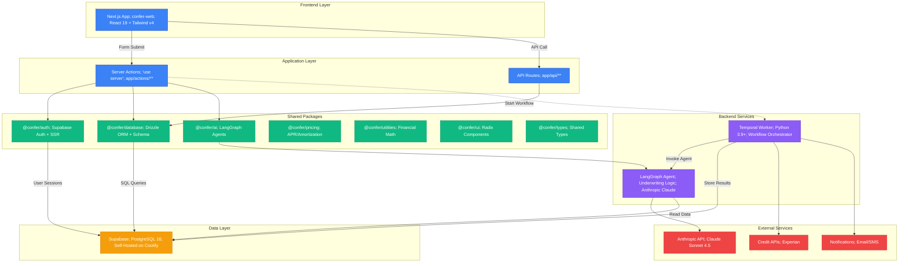
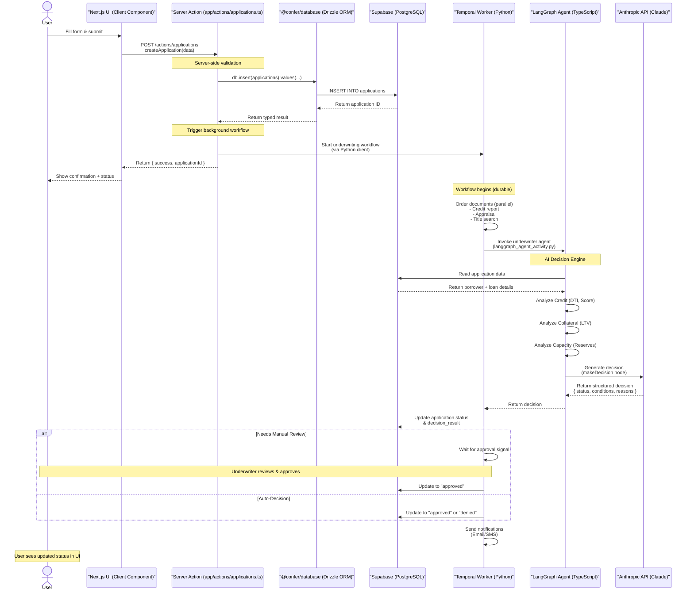

# Architecture Map - Confer Loan Origination System

**Document Version:** 1.0
**Last Updated:** 2026-01-26
**Maintainer:** System Architect

---

## Overview

The Confer Loan Origination System (LOS) is a **multi-tenant, platform-first monorepo** designed to power modern lending applications. It combines a Next.js frontend with a Python-based Temporal workflow engine, backed by PostgreSQL through Supabase.

### Architecture Philosophy

- **Platform-First**: Confer owns the core (database, auth, AI, UI system)
- **Client Applications**: Built on top of the core (currently: MoXi Global via `confer-web`)
- **Monorepo**: All shared packages and client apps in one repository
- **Bleeding Edge**: Next.js 16 + React 19 + Tailwind v4 + Node 24

---

## System Architecture Diagram



---

## Package Dependency Graph

### `confer-web` Dependencies

From `confer-los/apps/confer-web/package.json`:

```mermaid
graph LR
    CONFER_WEB[@confer/confer-web]

    %% Direct Workspace Dependencies
    CONFER_WEB --> AUTH[@confer/auth]
    CONFER_WEB --> DATABASE[@confer/database]

    %% Database Package Dependencies
    DATABASE --> TYPES[@confer/types]

    %% External Dependencies
    CONFER_WEB --> NEXT[Next.js 16.0.7]
    CONFER_WEB --> REACT[React 19.2.0]
    CONFER_WEB --> SUPABASE[@supabase/ssr<br/>@supabase/supabase-js]
    CONFER_WEB --> RADIX[Radix UI Components]
    CONFER_WEB --> FORM[React Hook Form]
    CONFER_WEB --> ZOD[Zod Validation]

    AUTH --> SUPABASE_PKG[@supabase/ssr<br/>@supabase/supabase-js]
    AUTH --> NEXT_PKG[Next.js]

    DATABASE --> DRIZZLE[Drizzle ORM]
    DATABASE --> POSTGRES[postgres.js]

    classDef workspace fill:#10b981,stroke:#059669,color:#fff
    classDef external fill:#64748b,stroke:#475569,color:#fff

    class AUTH,DATABASE,TYPES workspace
    class NEXT,REACT,SUPABASE,RADIX,FORM,ZOD,SUPABASE_PKG,NEXT_PKG,DRIZZLE,POSTGRES external
```

### All Workspace Packages

| Package | Purpose | Key Dependencies |
|---------|---------|------------------|
| `@confer/auth` | Authentication & Authorization | `@supabase/ssr`, `@supabase/supabase-js`, `next` |
| `@confer/database` | Database Schema & ORM | `drizzle-orm`, `postgres`, `@confer/types` |
| `@confer/ai` | AI Agents & Decision Engine | `@langchain/langgraph`, `@ai-sdk/anthropic`, `ai`, `zod` |
| `@confer/pricing` | Pricing Calculations | None (Pure Math) |
| `@confer/utilities` | Financial Math & Helpers | `date-fns`, `numeral` |
| `@confer/ui` | UI Component Library | `@radix-ui/react-slot`, `class-variance-authority` |
| `@confer/types` | Shared TypeScript Types | None (Pure Types) |

---

## Core Technologies

### Frontend Stack

| Technology | Version | Purpose |
|------------|---------|---------|
| **Next.js** | 16.0.7 | React Framework + Server Actions |
| **React** | 19.2.0 | UI Library |
| **Tailwind CSS** | 4.1.9 | Styling Framework |
| **TypeScript** | 5.x | Type Safety |
| **Radix UI** | Latest | Accessible Component Primitives |
| **React Hook Form** | Latest | Form Management |
| **Zod** | 3.22.4 | Schema Validation |

### Backend Stack

| Technology | Version | Purpose |
|------------|---------|---------|
| **Temporal** | 1.5.0+ (Python) | Durable Workflow Orchestration |
| **LangGraph** | 0.2.30 | AI Agent Framework |
| **LangChain** | 0.3.28 | AI Toolkit |
| **Python** | 3.9+ | Backend Language |
| **httpx** | 0.26.0+ | HTTP Client |

### Data & Infrastructure

| Technology | Version | Purpose |
|------------|---------|---------|
| **Supabase** | Latest | PostgreSQL Hosting + Auth |
| **PostgreSQL** | 16 | Primary Database |
| **Drizzle ORM** | 0.36.4 | Type-Safe ORM |
| **Coolify** | Latest | Self-Hosted PaaS |
| **Docker** | Latest | Containerization |

### AI & APIs

| Technology | Purpose |
|------------|---------|
| **Anthropic Claude Sonnet 4.5** | AI Underwriting Agent |
| **Vercel AI SDK** | AI Integration Layer |
| **@langchain/langgraph** | Agent Workflow Graphs |

---

## Data Flow

### Example: Submit Loan Application

This flow demonstrates how a user request travels through the system.



---

## Key Architectural Patterns

### 1. Server Actions for Mutations

**File:** `confer-los/apps/confer-web/app/actions/applications.ts`

```typescript
'use server'

import { db, applications } from '@confer/database'
import { revalidatePath } from 'next/cache'

export async function createApplication(data: ApplicationInput) {
  // Validation
  const validated = ApplicationSchema.parse(data)

  // Database insert via Drizzle
  const [app] = await db.insert(applications).values({
    organizationId: validated.orgId,
    borrowerId: validated.borrowerId,
    loanAmount: validated.amount,
    applicationData: validated.customFields, // JSONB
  }).returning()

  // Trigger workflow (optional)
  // await startUnderwritingWorkflow(app.id)

  // Revalidate cache
  revalidatePath('/applications')

  return { success: true, applicationId: app.id }
}
```

### 2. Drizzle ORM for Type-Safe Queries

**File:** `confer-los/packages/database/src/schema.ts`

```typescript
import { pgTable, uuid, text, numeric, jsonb } from 'drizzle-orm/pg-core'

export const applications = pgTable('applications', {
  id: uuid('id').primaryKey().defaultRandom(),
  organizationId: uuid('organization_id').notNull(),
  borrowerId: uuid('borrower_id').notNull(),
  loanAmount: numeric('loan_amount', { precision: 12, scale: 2 }),

  // JSONB for flexible data (legacy pattern)
  applicationData: jsonb('application_data').$type<{
    credit_score?: number
    annual_income?: number
    dti_ratio?: number
  }>(),

  decisionResult: jsonb('decision_result').$type<{
    decision: 'approved' | 'denied' | 'review'
    reasons: string[]
    confidence: number
  }>(),
})
```

**Usage in Server Action:**

```typescript
import { db, applications } from '@confer/database'
import { eq } from 'drizzle-orm'

// Type-safe query
const apps = await db.select().from(applications)
  .where(eq(applications.status, 'submitted'))

// TypeScript knows the shape of apps[0]
console.log(apps[0].applicationData.credit_score) // ✅ Type-safe
```

### 3. LangGraph for AI Agents

**File:** `confer-los/packages/ai/src/agents/underwriter.ts`

```typescript
import { StateGraph } from '@langchain/langgraph'
import { generateObject } from 'ai'
import { anthropic } from '../config'

const workflow = new StateGraph(UnderwritingAnnotation)
  .addNode('analyzeCredit', analyzeCredit)
  .addNode('analyzeCollateral', analyzeCollateral)
  .addNode('analyzeCapacity', analyzeCapacity)
  .addNode('makeDecision', makeDecision) // Calls Claude API
  .addEdge(START, 'analyzeCredit')
  .addEdge(START, 'analyzeCollateral')
  .addEdge(START, 'analyzeCapacity')
  .addEdge('analyzeCredit', 'makeDecision')
  .addEdge('makeDecision', END)

export const underwriterAgent = workflow.compile()
```

**Parallel Analysis → AI Decision:**
- Analyzes credit, collateral, capacity in parallel
- Feeds results to Claude Sonnet 4.5 for final decision
- Returns structured output (Zod schema)

### 4. Temporal for Durable Workflows

**File:** `confer-los/temporal/workflows/underwriting_workflow.py`

```python
from temporalio import workflow

@workflow.defn
class UnderwritingWorkflow:
    @workflow.run
    async def run(self, application_id: str):
        # Parallel document orders (5-10 min each)
        credit, appraisal, title = await asyncio.gather(
            workflow.execute_activity(order_credit_report, application_id),
            workflow.execute_activity(order_appraisal, application_id),
            workflow.execute_activity(order_title_search, application_id),
        )

        # Invoke AI agent (30s-1min)
        decision = await workflow.execute_activity(
            invoke_underwriter_agent,
            application_id,
            timeout=timedelta(minutes=2)
        )

        # Wait for manual approval if needed
        if decision['status'] == 'review':
            await workflow.wait_condition(lambda: self.approved)

        # Send notification
        await workflow.execute_activity(
            send_approval_email,
            application_id
        )

        return decision
```

**Why Temporal?**
- Survives server restarts (durable state)
- Built-in retries and error handling
- Handles long-running workflows (hours/days)
- Separates orchestration logic from business logic

---

## Integration Points

### 1. Next.js → Temporal

**Option A: Direct Python Exec (Development)**

```typescript
// app/actions/underwriting.ts
'use server'

import { exec } from 'child_process'
import { promisify } from 'util'

const execAsync = promisify(exec)

export async function startUnderwriting(applicationId: string) {
  const { stdout } = await execAsync(
    `python -c "from temporal.client import start_underwriting_workflow; import asyncio; print(asyncio.run(start_underwriting_workflow('${applicationId}')))"`
  )

  return { workflowId: stdout.trim() }
}
```

**Option B: HTTP API (Production)**

```typescript
// Call a Python FastAPI endpoint that starts the workflow
const response = await fetch('http://temporal-api:8000/start-workflow', {
  method: 'POST',
  body: JSON.stringify({ applicationId }),
})
```

### 2. Temporal → LangGraph

**File:** `confer-los/temporal/activities/langgraph_agent_activity.py`

```python
from temporalio import activity
import httpx

@activity.defn
async def invoke_underwriter_agent(application_id: str):
    # Call TypeScript LangGraph agent via HTTP or shared DB
    async with httpx.AsyncClient() as client:
        response = await client.post(
            'http://confer-web:3000/api/agents/underwrite',
            json={'applicationId': application_id}
        )
        return response.json()
```

### 3. LangGraph → Database

**File:** `confer-los/packages/ai/src/agents/underwriter.ts`

```typescript
async function analyzeCredit(state) {
  const { application } = state
  const { creditScore, annualIncome } = application.borrower

  // Pure calculation (no DB call needed - data in state)
  const monthlyIncome = annualIncome / 12
  const dti = (monthlyPayment / monthlyIncome) * 100

  return { analysis: { credit: { score: creditScore, dti } } }
}
```

---

## Deployment Architecture

```
┌─────────────────────────────────────────────────────────────┐
│                         Vercel                              │
│  ┌───────────────────────────────────────────────────────┐  │
│  │  confer-web (Next.js)                                 │  │
│  │  - Server Actions                                     │  │
│  │  - API Routes                                         │  │
│  │  - Edge Runtime                                       │  │
│  └───────────────────────────────────────────────────────┘  │
└─────────────────────────────────────────────────────────────┘
                           │
                           │ HTTPS
                           ▼
┌─────────────────────────────────────────────────────────────┐
│              Coolify (Self-Hosted PaaS)                     │
│  ┌──────────────────┐  ┌──────────────────┐                │
│  │  Supabase        │  │  Temporal Server │                │
│  │  - PostgreSQL 16 │  │  - Workflow Exec │                │
│  │  - Auth Service  │  │  - Task Queue    │                │
│  │  - REST API      │  │  - Web UI        │                │
│  └──────────────────┘  └──────────────────┘                │
│                                                              │
│  ┌──────────────────────────────────────────┐               │
│  │  Temporal Worker (Python)                │               │
│  │  - Polls for workflows                   │               │
│  │  - Executes activities                   │               │
│  │  - Calls external APIs                   │               │
│  └──────────────────────────────────────────┘               │
└─────────────────────────────────────────────────────────────┘
                           │
                           │ HTTPS
                           ▼
                ┌──────────────────────┐
                │  Anthropic API       │
                │  (Claude Sonnet 4.5) │
                └──────────────────────┘
```

---

## Database Schema (High-Level)

### Core Tables

| Table | Purpose | Key Fields |
|-------|---------|------------|
| `organizations` | Multi-tenant root | `id`, `name`, `settings` (JSONB) |
| `profiles` | User accounts | `id`, `role`, `organization_id`, `metadata` (JSONB) |
| `applications` | Loan applications | `id`, `borrower_id`, `loan_amount`, `application_data` (JSONB), `decision_result` (JSONB) |
| `application_events` | Audit trail | `id`, `application_id`, `event_type`, `metadata` (JSONB) |
| `customers` | Borrower details | `id`, `organization_id`, `first_name`, `last_name`, `email` |
| `properties` | Property info | `id`, `organization_id`, `address`, `value` |
| `loan_products` | Product catalog | `id`, `organization_id`, `name`, `max_ltv`, `min_credit_score` |

**Access Method:**
- Local: Direct PostgreSQL connection via Drizzle
- Production: Supabase REST API (port 5432 not exposed)

---

## Technology Justifications

### Why Next.js Server Actions?

- **Co-location**: Keep server logic next to UI components
- **Type-safety**: Share types between client and server
- **Automatic serialization**: No manual API route setup
- **Progressive enhancement**: Forms work without JS

### Why Drizzle ORM?

- **Type-safety**: End-to-end TypeScript types
- **Performance**: Minimal overhead, close to raw SQL
- **Flexibility**: Supports JSONB for dynamic schemas
- **Developer Experience**: Great autocomplete and errors

### Why Temporal?

- **Durability**: Workflows survive crashes and restarts
- **Observability**: Built-in UI for monitoring workflows
- **Reliability**: Handles retries, timeouts, compensation
- **Scalability**: Distributed architecture for high throughput

### Why LangGraph?

- **Structured AI**: Define AI workflows as graphs (not chains)
- **Observability**: See each node's execution
- **Modularity**: Reusable nodes for different agents
- **Integration**: Works with Anthropic, OpenAI, etc.

### Why Supabase on Coolify?

- **Self-Hosted**: Full control over data
- **Cost**: No per-row or per-GB pricing
- **Familiarity**: PostgreSQL + standard REST API
- **Features**: Auth, storage, real-time out of the box

---

## Current Limitations

1. **Temporal Integration**: Not yet fully wired to Next.js (planned)
2. **Multi-Tenancy**: Currently in single-tenant mode (simplified for MVP)
3. **Document Management**: Not yet implemented (future iteration)
4. **Direct DB Access**: Production Supabase port 5432 not exposed (must use SQL Editor for migrations)

---

## Next Steps

1. **Wire Temporal**: Connect Server Actions to Temporal workflows
2. **Enable Multi-Tenancy**: Activate RLS policies in Supabase
3. **Add Document Storage**: Integrate Supabase Storage for PDFs
4. **Monitoring**: Add OpenTelemetry for observability
5. **Testing**: Expand E2E tests for critical workflows

---

## References

- [Confer LOS README](../../confer-los/README.md)
- [Database Package README](../../confer-los/packages/database/README.md)
- [Temporal README](../../confer-los/temporal/README.md)
- [Next.js 16 Docs](https://nextjs.org/docs)
- [Temporal Docs](https://docs.temporal.io/)
- [LangGraph Docs](https://langchain-ai.github.io/langgraph/)
- [Drizzle ORM Docs](https://orm.drizzle.team/)

---

**Document Status:** ✅ Complete
**Review Date:** 2026-02-26
