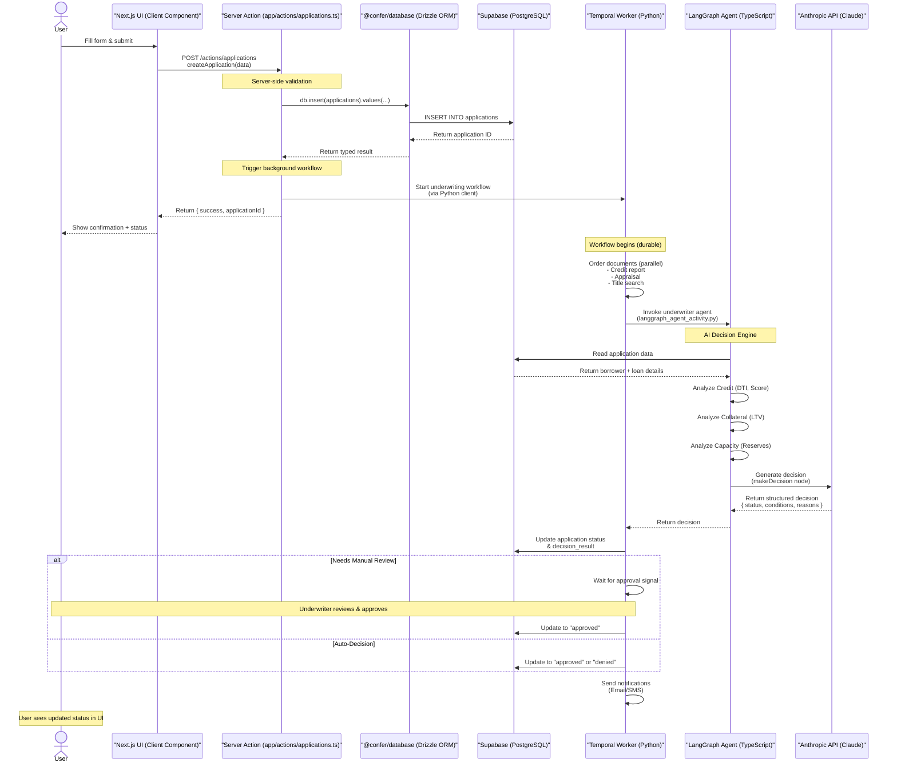

# 02. Data Flow & Business Logic

> **Last Updated:** 2026-01-26
> **Author:** Product Engineering Team

This document traces the critical user flows and business logic in the Loan Origination System, focusing on how data moves through the application from borrower input to underwriting decisions.

---

## Table of Contents

1. [The "Apply" Flow: Borrower Journey](#1-the-apply-flow-borrower-journey)
2. [The Underwriting Workflow](#2-the-underwriting-workflow)
3. [AI Integration: The Underwriter Agent](#3-ai-integration-the-underwriter-agent)
4. [Key Server Actions](#4-key-server-actions)
5. [Data Flow Diagrams](#5-data-flow-diagrams)

---

## 1. The "Apply" Flow: Borrower Journey

### Overview

The borrower application is a **39-step progressive wizard** mapped to URLA 1003 compliance sections. The flow supports both anonymous users (steps 1-9) and authenticated users (steps 10+).

**Location:** `confer-los/apps/confer-web/app/apply/`

### Architecture

```
┌─────────────────────────────────────────────────────────┐
│  Entry Point: /apply/page.tsx                           │
│  - Checks for existing session                          │
│  - Creates anonymous session if needed                  │
│  - Loads or creates draft application                   │
│  - Redirects to current step                            │
└─────────────────────────────────────────────────────────┘
                        ↓
┌─────────────────────────────────────────────────────────┐
│  ApplicationProvider (Context)                          │
│  - Manages application state (React Context)            │
│  - Tracks: applicationId, data, currentStep, metadata   │
│  - Actions: updateField(), saveStep(), loadApplication()│
└─────────────────────────────────────────────────────────┘
                        ↓
┌─────────────────────────────────────────────────────────┐
│  39 Step Pages (/apply/{step-name}/page.tsx)           │
│  - Each step renders form fields                        │
│  - Updates local state optimistically                   │
│  - Saves to backend on "Next" button click              │
│  - Navigates to next step                               │
└─────────────────────────────────────────────────────────┘
```

### Step Breakdown

#### Phase 1: Pre-Qualification (Steps 1-9) - Anonymous Allowed

| Step # | Route | Purpose | Data Captured |
|--------|-------|---------|---------------|
| 1 | `/apply/loan-purpose` | Loan intent | `loanPurpose: "purchase" \| "refinance"` |
| 2 | `/apply/property-use` | Occupancy type | `propertyUse: "primary_residence" \| "second_home" \| "investment"` |
| 3 | `/apply/first-time-buyer` | Buyer status | `firstTimeBuyer: boolean` |
| 4 | `/apply/home-found` | Property identified | `homeFound: boolean` |
| 5 | `/apply/property-address` | Property location | `propertyAddress: { street, city, state, zip }` |
| 6 | `/apply/property-type` | Property category | `propertyType: "single_family" \| "condo" \| ...` |
| 7 | `/apply/purchase-price` | Transaction value | `purchasePrice: number` |
| 8 | `/apply/down-payment` | Down payment amount | `downPayment: number` |
| 9 | `/apply/credit-score` | Self-reported credit | `creditScore: number` |

**Key File:** `confer-los/apps/confer-web/app/apply/page.tsx:12-50`
```typescript
async function initSession() {
  let user = await getCurrentAuthUser()
  if (!user) {
    await signInAnonymously() // Anonymous auth for steps 1-9
  }

  const draft = await getOrCreateDraftApplication()
  const step = draft.currentStep || "loan-purpose"
  router.replace(`/apply/${step}`)
}
```

#### Phase 2: Account Creation (Step 10) - Authentication Checkpoint

| Step # | Route | Purpose | Trigger |
|--------|-------|---------|---------|
| 10 | `/apply/create-account` | User registration | Creates authenticated account, links to draft |

**Authentication Transition:**
- Anonymous user ID is preserved in `key_information._authUserId`
- Customer record created with `auth_user_id` linking to Supabase Auth
- `primary_customer_id` is set on the application record

#### Phase 3: Personal Information (Steps 11-22)

| Step Range | Section | Data Model |
|------------|---------|------------|
| 11-16 | Borrower Identity | `borrower: { firstName, lastName, email, phone, ssn, dob, maritalStatus }` |
| 17-19 | Address History | `currentAddress, previousAddress, housingStatus, housingPayment` |
| 20-22 | Co-Borrower (Conditional) | `coBorrower: { name, contact, ... }` |

**Conditional Logic Example:** `confer-los/apps/confer-web/app/apply/co-borrower-decision/page.tsx`
```typescript
if (coBorrowerDecision === "yes") {
  router.push("/apply/co-borrower-name")
} else {
  router.push("/apply/employment-intro")
}
```

#### Phase 4: Employment & Income (Steps 23-28)

| Step # | Route | Data Captured |
|--------|-------|---------------|
| 23 | `/apply/employment-intro` | Information overview |
| 24 | `/apply/employment-status` | `employmentStatus: "employed" \| "self_employed" \| "retired" \| "not_employed"` |
| 25 | `/apply/employer-details` | `employment: { employerName, position, startDate }` |
| 26 | `/apply/monthly-income` | `employment.grossMonthlyIncome: number` |
| 27 | `/apply/additional-income` | `additionalIncome: [{ type, amount }]` |
| 28 | `/apply/income-summary` | Review screen |

#### Phase 5: Assets (Steps 29-32)

| Step # | Route | Data Captured |
|--------|-------|---------------|
| 29 | `/apply/funds-overview` | Assets introduction |
| 30 | `/apply/asset-types` | `assetTypes: ["checking", "savings", "retirement"]` |
| 31 | `/apply/asset-details` | `assets: [{ type, institutionName, accountNumber, value }]` |
| 32 | `/apply/gift-funds` | `giftFunds: { hasGift, amount, relationship }` |

#### Phase 6: Declarations (Steps 33-35)

URLA Section H compliance - borrower declarations

| Step # | Route | Questions |
|--------|-------|-----------|
| 33 | `/apply/declarations-intro` | Overview |
| 34 | `/apply/declarations` | Judgments, bankruptcies, foreclosures, lawsuits, obligations |
| 35 | `/apply/declarations-additional` | Property ownership, down payment source, occupancy intent |

#### Phase 7: Credit & Demographics (Steps 36-37)

| Step # | Route | Purpose |
|--------|-------|---------|
| 36 | `/apply/credit-check-intro` | Credit authorization consent |
| 37 | `/apply/demographics` | HMDA compliance (ethnicity, race, sex - optional) |

#### Phase 8: Review & Submit (Steps 38-39)

| Step # | Route | Action |
|--------|-------|--------|
| 38 | `/apply/review-submit` | Full application review with edit capability |
| 39 | `/apply/confirmation` | Success screen with application number |

**Submission Logic:** `confer-los/apps/confer-web/app/actions/applications.ts:713-776`

```typescript
export async function submitApplication(applicationId: string) {
  // Generate unique application number (APP-2026-00001)
  const applicationNumber = await generateApplicationNumber()

  // Update status: draft → submitted
  await supabase
    .from("applications")
    .update({
      status: "submitted",
      application_number: applicationNumber,
      submitted_at: new Date().toISOString()
    })
    .eq("id", applicationId)

  return { success: true, applicationNumber }
}
```

### State Management

**Context Provider:** `confer-los/apps/confer-web/contexts/ApplicationContext.tsx:51-164`

**Data Structure:**
```typescript
interface ApplicationDraftData {
  _meta: {
    workflowType: "borrower_apply"
    currentStep: string              // e.g., "legal-name"
    currentStepNumber: number         // 1-39
    completedSteps: string[]          // ["loan-purpose", "property-use", ...]
    lastUpdatedAt: string             // ISO timestamp
  }
  _authUserId: string                 // Supabase Auth user ID

  // Form data (dynamically added)
  loanPurpose: string
  propertyUse: string
  borrower: { firstName, lastName, ... }
  employment: { employmentStatus, grossMonthlyIncome, ... }
  declarations: { ... }
  // ... other form sections
}
```

**Persistence Flow:**
```
User Input
    ↓
updateField("borrower", { firstName: "John" })  // Optimistic update (in-memory)
    ↓
User clicks "Next"
    ↓
saveStep("/apply/legal-name")
    ↓
saveDraftStep(applicationId, "legal-name", data) // Server action
    ↓
Supabase UPDATE applications SET key_information = $1 WHERE id = $2
    ↓
router.push("/apply/contact-info")
```

**Key Files:**
- State management: `confer-los/apps/confer-web/contexts/ApplicationContext.tsx`
- Step mapping: `confer-los/apps/confer-web/lib/types/urla-step-mapping.ts`
- Server actions: `confer-los/apps/confer-web/app/actions/applications.ts:498-707`

---

## 2. The Underwriting Workflow

### Overview

The underwriting workflow is implemented as a **Temporal workflow** in Python, orchestrating parallel document ordering, AI-powered decision-making, human-in-the-loop approval, and automated notifications.

**Location:** `confer-los/temporal/workflows/underwriting_workflow.py`

### Workflow Architecture

```python
@workflow.defn
class UnderwritingWorkflow:
    def __init__(self):
        self.approved = False
        self.manual_review_complete = False

    @workflow.run
    async def run(self, application_id: str) -> dict:
        # 4-step orchestration (detailed below)
```

### Step-by-Step Execution

#### Step 1: Parallel Document Ordering (Lines 60-103)

Three activities execute in parallel with independent retry policies:

**Activity 1: Credit Report**
- **Function:** `order_credit_report(application_id)`
- **Location:** `confer-los/temporal/activities/document_activities.py:18-48`
- **Timeout:** 5 minutes
- **Retry Policy:** 3 attempts, exponential backoff (1s → 10s)
- **Returns:**
  ```python
  {
    "application_id": str,
    "score": int,                  # e.g., 750
    "provider": "Experian",
    "tradelines": int,             # Number of credit accounts
    "derogatory_marks": int,
    "inquiries_last_6mo": int
  }
  ```

**Activity 2: Appraisal**
- **Function:** `order_appraisal(application_id)`
- **Location:** `confer-los/temporal/activities/document_activities.py:52-72`
- **Timeout:** 5 minutes
- **Retry Policy:** 3 attempts
- **Returns:**
  ```python
  {
    "application_id": str,
    "appraised_value": float,      # e.g., 425000.0
    "condition": "Good",
    "appraisal_date": "2026-01-26",
    "appraiser": "ABC Appraisal Co."
  }
  ```

**Activity 3: Title Search**
- **Function:** `order_title_search(application_id)`
- **Location:** `confer-los/temporal/activities/document_activities.py:76-96`
- **Timeout:** 5 minutes
- **Retry Policy:** 3 attempts
- **Returns:**
  ```python
  {
    "application_id": str,
    "title_clear": bool,
    "liens": list,                 # Existing liens on property
    "encumbrances": list,          # Easements, restrictions
    "title_company": "Title Co."
  }
  ```

**Parallel Execution:**
```python
credit_task = workflow.execute_activity(order_credit_report, ...)
appraisal_task = workflow.execute_activity(order_appraisal, ...)
title_task = workflow.execute_activity(order_title_search, ...)

# Wait for all three to complete
credit_report, appraisal, title_search = await workflow.wait([
    credit_task, appraisal_task, title_task
])
```

#### Step 2: AI Underwriter Agent Invocation (Lines 105-126)

**Activity:** `invoke_underwriter_agent(params)`
- **Location:** `confer-los/temporal/activities/langgraph_agent_activity.py:20-100`
- **Timeout:** 10 minutes (generous for AI processing)
- **Retry Policy:** 2 attempts (limited for non-deterministic AI)

**Input Parameters:**
```python
{
  "application_id": application_id,
  "credit_report": credit_report,
  "appraisal": appraisal,
  "title_search": title_search
}
```

**Current Decision Logic (Simulated - will integrate with LangGraph agent):**
```python
if credit_score >= 740 and title_clear:
    return {
        "recommendation": "approved",
        "confidence": 95.0,
        "conditions": [],
        "reasoning": "Strong credit profile with clear title"
    }
elif credit_score >= 680 and title_clear:
    return {
        "recommendation": "conditional_approval",
        "confidence": 75.0,
        "conditions": ["Verify employment", "Provide 2 months bank statements"],
        "reasoning": "Good credit but requires income verification"
    }
else:
    return {
        "recommendation": "denied",
        "confidence": 85.0,
        "conditions": [],
        "reasoning": "Credit score below threshold or title issues"
    }
```

#### Step 3: Manual Review Handling (Lines 128-153)

**Trigger:** When AI recommends `"conditional_approval"`

**Wait Mechanism:**
```python
if decision["recommendation"] == "conditional_approval":
    await workflow.wait_condition(
        lambda: self.manual_review_complete,
        timeout=timedelta(hours=24)
    )

    if self.approved:
        decision["recommendation"] = "approved"
    else:
        decision["recommendation"] = "denied"
```

**Signal-Based Control:**

```python
@workflow.signal
async def approve(self):
    """External signal to approve (sent from UI)"""
    self.approved = True
    self.manual_review_complete = True

@workflow.signal
async def deny(self):
    """External signal to deny (sent from UI)"""
    self.approved = False
    self.manual_review_complete = True
```

**Timeout Handling:**
- If no signal received within 24 hours → defaults to "denied"
- Adds condition: `"Manual review timeout"`

**How UI Sends Signals (from client.py):**
```python
# From Temporal client
async def approve_workflow(workflow_id: str):
    handle = client.get_workflow_handle(workflow_id)
    await handle.signal(UnderwritingWorkflow.approve)

async def deny_workflow(workflow_id: str):
    handle = client.get_workflow_handle(workflow_id)
    await handle.signal(UnderwritingWorkflow.deny)
```

#### Step 4: Notification Dispatch (Lines 154-174)

**Approval Email:**
```python
await workflow.execute_activity(
    send_approval_email,
    {
        "application_id": application_id,
        "decision": decision
    },
    start_to_close_timeout=timedelta(minutes=2)
)
```

**Denial Email:**
```python
await workflow.execute_activity(
    send_denial_email,
    {
        "application_id": application_id,
        "decision": decision
    },
    start_to_close_timeout=timedelta(minutes=2)
)
```

**Email Activity Implementation:** `confer-los/temporal/activities/notification_activities.py`

### Workflow Invocation

**Workflow ID Format:** `underwrite-{application_id}`
**Task Queue:** `underwriting-queue`

**From Python:**
```python
from temporal.client import start_underwriting_workflow

workflow_id = await start_underwriting_workflow("app-123")
# Returns: "underwrite-app-123"
```

**From Next.js (Future Integration):**
```typescript
export async function startUnderwriting(applicationId: string) {
  const { stdout } = await execAsync(
    `python -c "from temporal.client import start_underwriting_workflow;
     import asyncio;
     print(asyncio.run(start_underwriting_workflow('${applicationId}')))"`
  )
  return stdout.trim()
}
```

### Workflow Status Queries

**Query Status:**
```python
@workflow.query
def get_status(self) -> str:
    if self.manual_review_complete:
        return "approved" if self.approved else "denied"
    return "pending_review"
```

**From Client:**
```python
status = await client.get_workflow_status("underwrite-app-123")
# Returns: "pending_review" | "approved" | "denied"
```

**Infrastructure:**
- **Temporal Server:** `temporal.confersolutions.ai:7233`
- **Temporal UI:** `https://temporal.confersolutions.ai:8233`
- **Worker:** `confer-los/temporal/worker.py` (polls `underwriting-queue`)

---

## 3. AI Integration: The Underwriter Agent

### Overview

The AI underwriting agent is a **LangGraph-based multi-agent system** using Claude 3.5 Sonnet. It performs parallel analysis across three dimensions (Credit, Collateral, Capacity) before synthesizing a final decision.

**Location:** `confer-los/packages/ai/src/agents/underwriter.ts`
**Status:** ⚠️ **Not yet integrated** - Ready for use but not wired into production

### Agent Architecture

```
                    START
                      |
         ____________|____________
        |            |            |
   analyzeCredit  analyzeCollateral  analyzeCapacity
        |            |            |
        |____________|____________|
                     |
              makeDecision (Claude AI)
                     |
                    END
```

### Analysis Nodes

#### Node 1: Credit Analysis

**Function:** `analyzeCredit(state)` (Lines 38-63)

**Calculations:**
```typescript
const monthlyIncome = annualIncome / 12
const dti = (monthlyPayment / monthlyIncome) * 100

let status: "pass" | "fail" | "review"
if (creditScore >= 720 && dti <= thresholds.maxDti) status = "pass"
else if (creditScore < thresholds.minCreditScore || dti > 50) status = "fail"
else status = "review"
```

**Returns:**
```typescript
{
  credit: {
    score: 750,
    history: "Good",
    dti: 28.5,
    status: "pass"
  }
}
```

**Thresholds:**
- Min Credit Score: 620
- Max DTI: 43%

#### Node 2: Collateral Analysis

**Function:** `analyzeCollateral(state)` (Lines 66-87)

**Calculations:**
```typescript
const ltv = (loanAmount / propertyValue) * 100

let status: "pass" | "fail" | "review"
if (ltv <= 80) status = "pass"
else if (ltv > thresholds.maxLtv) status = "fail"
else status = "review"
```

**Returns:**
```typescript
{
  collateral: {
    ltv: 75.0,
    status: "pass"
  }
}
```

**Thresholds:**
- Max LTV: 95%

#### Node 3: Capacity Analysis

**Function:** `analyzeCapacity(state)` (Lines 90-112)

**Calculations:**
```typescript
const monthsReserves = assets / monthlyPayment

let status: "pass" | "fail" | "review"
if (monthsReserves >= 6) status = "pass"
else if (monthsReserves < thresholds.minReservesMonths) status = "fail"
else status = "review"
```

**Returns:**
```typescript
{
  capacity: {
    incomeStability: "Stable",
    reserves: 8.5,
    status: "pass"
  }
}
```

**Thresholds:**
- Min Reserves: 2 months

### AI Decision Node

**Function:** `makeDecision(state)` (Lines 114-149)

**Prompt to Claude:**
```typescript
You are an expert Mortgage Underwriter. Analyze the following loan application
and the preliminary analysis results to make a final decision.

Application Data:
- Borrower Credit Score: ${creditScore}
- Annual Income: $${annualIncome}
- Assets: $${assets}
- Loan Amount: $${loanAmount}
- Property Value: $${propertyValue}

Preliminary Analysis:
- Credit Analysis: ${JSON.stringify(analysis.credit)}
- Collateral Analysis: ${JSON.stringify(analysis.collateral)}
- Capacity Analysis: ${JSON.stringify(analysis.capacity)}

Guidelines:
- Approve if all factors are strong (Credit > 720, LTV < 80, DTI < 43)
- Deny if there are major red flags (Credit < 620, Bankruptcy, etc.)
- Conditional Approval for borderline cases. List specific conditions.
- Be conservative but fair.
```

**Structured Output (Zod Schema):**
```typescript
const UnderwritingDecisionSchema = z.object({
  status: z.enum(["approved", "denied", "conditional_approval"]),
  confidence: z.number().min(0).max(1),
  reasoning: z.string(),
  conditions: z.array(z.string())
})
```

**Model Configuration:**
- **Model:** `claude-3-5-sonnet-latest`
- **Provider:** Anthropic API (`ANTHROPIC_API_KEY`)

### Input/Output Interface

**Input (ApplicationData):**
```typescript
{
  id: "app-123",
  borrower: {
    creditScore: 750,
    annualIncome: 120000,
    employmentHistory: "5 years",
    assets: 50000
  },
  loan: {
    amount: 300000,
    monthlyPayment: 2100,
    productType: "Conventional"
  },
  property: {
    value: 400000,
    address: "123 Main St, City, State 12345"
  }
}
```

**Output (UnderwritingDecision):**
```typescript
{
  status: "approved",
  confidence: 0.92,
  reasoning: "Strong credit profile (750) with healthy DTI (28.5%) and sufficient reserves (8.5 months). LTV of 75% is well within guidelines.",
  conditions: []
}
```

### How to Invoke (When Integrated)

**From Server Action:**
```typescript
import { underwriterAgent } from "@confer/ai"

export async function evaluateApplication(applicationId: string) {
  const application = await getApplicationData(applicationId)

  const result = await underwriterAgent.invoke({
    application,
    config: { /* custom thresholds */ },
    analysis: {}
  })

  return result.decision
}
```

**Integration Point (Recommended):**
- Add to `confer-los/temporal/activities/langgraph_agent_activity.py`
- Call from Step 2 of Underwriting Workflow
- Replace current simulated logic with actual LangGraph invocation

---

## 4. Key Server Actions

Server actions are the primary data mutation layer in the Next.js application. They handle validation, database operations, and cache revalidation.

**Location:** `confer-los/apps/confer-web/app/actions/`

### Application Lifecycle Actions

**File:** `applications.ts`

#### Create Application
```typescript
createApplication(data: {
  loan_product_id: string
  property_id?: string
  loan_amount?: number
  occupancy_type?: "primary_residence" | "second_home" | "investment"
  status?: string
  assigned_to?: string
  primary_customer_id?: string
  key_information?: Record<string, any>
})
```

**Logic:**
1. Validates `loan_product_id` exists
2. Retrieves `organization_id` from loan product
3. Generates unique `application_number` (APP-YYYY-NNNNN)
4. Creates application with status "draft"
5. Revalidates cache paths

**Location:** `applications.ts:231-301`

#### Get or Create Draft (Borrower Portal)
```typescript
getOrCreateDraftApplication(): Promise<{
  applicationId: string
  data: ApplicationDraftData
  currentStep: string
}>
```

**Logic:**
1. Gets current user (anonymous or authenticated)
2. Searches for existing draft by `key_information->>'_authUserId'`
3. If exists: returns draft with current step
4. If not: creates new draft with workflow metadata
5. Handles anonymous → authenticated transition

**Location:** `applications.ts:505-610`

**Key Innovation - Anonymous Session Handling:**
```typescript
// Anonymous users tracked by auth user ID in JSONB
key_information: {
  _meta: { workflowType: "borrower_apply", currentStep: "loan-purpose", ... },
  _authUserId: "anon-user-uuid-123",
  // ... form data
}

// When user creates account, customer record links via auth_user_id
// Application's primary_customer_id is updated, but _authUserId persists
```

#### Save Draft Step
```typescript
saveDraftStep(
  applicationId: string,
  stepKey: string,
  stepData: Record<string, any>
): Promise<{ success: boolean }>
```

**Logic:**
1. Fetches current `key_information`
2. Merges new step data
3. Adds step to `completedSteps` set
4. Updates `currentStep` and `lastUpdatedAt`
5. Saves entire JSONB structure atomically

**Location:** `applications.ts:615-675`

#### Submit Application
```typescript
submitApplication(applicationId: string): Promise<{
  applicationNumber: string
}>
```

**Logic:**
1. Generates unique application number (with conflict check)
2. Updates status: `draft` → `submitted`
3. Sets `submitted_at` timestamp
4. Returns application number for confirmation screen

**Location:** `applications.ts:713-776`

### Financial Data Actions

#### Income Management

**File:** `incomes.ts`

```typescript
createIncome(data: {
  application_id: string
  customer_id: string
  income_type: "employment" | "self_employment" | "rental" | "other"
  monthly_amount: number
  include_in_qualification: boolean
  verification_status: "pending" | "verified" | "rejected"
})
```

**Helper Functions:**
```typescript
getQualifyingIncome(application_id: string): Promise<number>
// Returns sum of income where include_in_qualification = true

getApplicationTotalIncome(application_id: string): Promise<{
  [income_type: string]: number
}>
// Returns income breakdown by type
```

#### Asset Management

**File:** `assets.ts`

**Key Pattern: Multi-owner Junction Table**
```typescript
createAsset(data: {
  asset_category: "checking" | "savings" | "retirement" | "stocks" | "other"
  value: number
  verification_status: "pending" | "verified" | "rejected"
  verified_value?: number
  is_gift: boolean
  is_grant: boolean
}) {
  // 1. Create asset record
  const asset = await insert("assets", data)

  // 2. Create ownership records
  const ownerships = ownerIds.map(id => ({
    asset_id: asset.id,
    customer_id: id,
    ownership_percentage: 100 / ownerIds.length
  }))
  await insert("asset_ownership", ownerships)

  // 3. Rollback on failure
  if (error) await delete("assets", asset.id)
}
```

**Helper Functions:**
```typescript
getTotalAssets(application_id: string): Promise<{
  [category: string]: number
}>

getLiquidAssets(application_id: string): Promise<number>
// Filters for: checking, savings, money_market
```

#### Liability Management

**File:** `liabilities.ts`

**DTI Calculation Support:**
```typescript
getDtiLiabilities(application_id: string): Promise<Liability[]>
// Excludes:
// - exclude_from_dti = true
// - to_be_paid_off_at_closing = true

getTotalMonthlyLiabilities(application_id: string): Promise<number>
// Sum of monthly_payment for qualifying liabilities
```

### Document Management

**File:** `documents.ts`

#### Upload Document
```typescript
uploadBorrowerDocument(
  file: File,
  application_id: string,
  document_type: "pay_stub" | "w2" | "tax_return" | "bank_statement" | "other"
): Promise<{ documentId: string }>
```

**Process:**
1. Uploads file to Supabase Storage (bucket: `loan-documents`)
2. Creates database record with metadata:
   - `file_name`, `file_path`, `file_size`, `mime_type`
   - `status: "pending"`
   - `period_start`, `period_end`, `year` (for dated documents)

#### Review Document
```typescript
reviewDocument(
  document_id: string,
  status: "approved" | "rejected" | "expired",
  rejection_reason?: string
): Promise<{ success: boolean }>
```

**Updates:**
- `status`
- `reviewer_id` (current user)
- `reviewed_at` (timestamp)
- `rejection_reason` (if rejected)

### Task Management

**File:** `org/tasks.ts`

```typescript
createTask(data: {
  application_id?: string
  customer_id?: string
  assigned_to?: string
  title: string
  description: string
  status: "to_do" | "in_progress" | "completed" | "cancelled"
  priority: "low" | "medium" | "high" | "urgent"
  due_date?: string
})
```

**Status Progression:**
```
to_do → in_progress → completed
                   ↘ cancelled
```

### Common Patterns

#### Pattern 1: Validation Before Mutation
```typescript
// Zod schema validation
const validated = createApplicationSchema.parse(data)

// Verify referenced entities exist
const { data: loanProduct } = await supabase
  .from("loan_products")
  .select("id, organization_id")
  .eq("id", validated.loan_product_id)
  .single()

if (!loanProduct) {
  return { success: false, error: "Invalid loan product" }
}
```

#### Pattern 2: Admin vs User Client
```typescript
// Admin client (bypasses RLS, uses service role key)
const adminClient = createAdminClient()

// User client (RLS enforced, uses session)
const supabase = await createClient()
```

**Usage:**
- **Admin client:** Global queries, application number generation, cross-org operations
- **User client:** Borrower portal, RLS-filtered data access

#### Pattern 3: JSONB for Flexibility
```typescript
// Address as JSONB
address: {
  street: "123 Main St",
  city: "Anytown",
  state: "CA",
  zip: "12345",
  country: "USA"
}

// Workflow metadata as JSONB
key_information: {
  _meta: { workflowType, currentStep, completedSteps, ... },
  _authUserId: "uuid",
  loanPurpose: "purchase",
  borrower: { ... },
  // Dynamic schema
}
```

#### Pattern 4: Cache Revalidation
```typescript
const { error } = await supabase.from("applications").insert(data)

if (!error) {
  revalidatePath("/dashboard/applications")
  revalidatePath("/dashboard/pipeline")
  revalidatePath("/admin/applications")
}
```

**Trigger:** All data mutations
**Effect:** Next.js cache invalidation → automatic page refreshes

---

## 5. Data Flow Diagrams

### Borrower Application Flow

```
┌─────────────────────────────────────────────────────────────────┐
│  User Visits /apply                                             │
└────────────────────────┬────────────────────────────────────────┘
                         ↓
┌─────────────────────────────────────────────────────────────────┐
│  Check Auth Status                                              │
│  - getCurrentAuthUser()                                         │
│  - If none: signInAnonymously()                                 │
└────────────────────────┬────────────────────────────────────────┘
                         ↓
┌─────────────────────────────────────────────────────────────────┐
│  Get or Create Draft                                            │
│  - getOrCreateDraftApplication()                                │
│  - Search: key_information->>'_authUserId' = user.id            │
│  - If exists: load draft, redirect to currentStep               │
│  - If not: create new draft with metadata                       │
└────────────────────────┬────────────────────────────────────────┘
                         ↓
┌─────────────────────────────────────────────────────────────────┐
│  Steps 1-9: Pre-Qualification (Anonymous)                       │
│  - User fills forms (loan purpose, property, credit)            │
│  - Each step: updateField() → saveStep() → next route           │
│  - Data stored in key_information JSONB                         │
└────────────────────────┬────────────────────────────────────────┘
                         ↓
┌─────────────────────────────────────────────────────────────────┐
│  Step 10: Create Account                                        │
│  - User registers (email/password or OAuth)                     │
│  - Customer record created with auth_user_id                    │
│  - Application.primary_customer_id set                          │
│  - _authUserId preserved for session continuity                 │
└────────────────────────┬────────────────────────────────────────┘
                         ↓
┌─────────────────────────────────────────────────────────────────┐
│  Steps 11-37: Full Application (Authenticated)                  │
│  - Personal info (borrower, co-borrower)                        │
│  - Employment & income                                          │
│  - Assets                                                       │
│  - Declarations                                                 │
│  - Demographics (HMDA compliance)                               │
│  - Each step saves to key_information                           │
└────────────────────────┬────────────────────────────────────────┘
                         ↓
┌─────────────────────────────────────────────────────────────────┐
│  Step 38: Review & Submit                                       │
│  - Display all collected data                                   │
│  - Allow edit navigation                                        │
│  - Submit button: submitApplication(applicationId)              │
└────────────────────────┬────────────────────────────────────────┘
                         ↓
┌─────────────────────────────────────────────────────────────────┐
│  Submit Application Action                                      │
│  - Generate application_number (APP-2026-00001)                 │
│  - Update status: draft → submitted                             │
│  - Set submitted_at timestamp                                   │
│  - Revalidate cache paths                                       │
└────────────────────────┬────────────────────────────────────────┘
                         ↓
┌─────────────────────────────────────────────────────────────────┐
│  Step 39: Confirmation                                          │
│  - Display application number                                   │
│  - Next steps instructions                                      │
└─────────────────────────────────────────────────────────────────┘
```

### Underwriting Workflow

```
┌─────────────────────────────────────────────────────────────────┐
│  Trigger: Application status → "underwriting"                   │
│  Action: startUnderwritingWorkflow(applicationId)               │
│  Workflow ID: underwrite-{applicationId}                        │
│  Task Queue: underwriting-queue                                 │
└────────────────────────┬────────────────────────────────────────┘
                         ↓
┌─────────────────────────────────────────────────────────────────┐
│  Step 1: Parallel Document Ordering                             │
│  ┌──────────────┐  ┌──────────────┐  ┌──────────────┐          │
│  │ Credit       │  │ Appraisal    │  │ Title Search │          │
│  │ Report       │  │              │  │              │          │
│  │              │  │              │  │              │          │
│  │ Timeout: 5m  │  │ Timeout: 5m  │  │ Timeout: 5m  │          │
│  │ Retries: 3   │  │ Retries: 3   │  │ Retries: 3   │          │
│  └──────┬───────┘  └──────┬───────┘  └──────┬───────┘          │
│         │                  │                  │                  │
│         └──────────────────┼──────────────────┘                  │
│                            ↓                                     │
│         ┌──────────────────────────────────┐                    │
│         │ Wait for all three to complete   │                    │
│         └──────────────────┬───────────────┘                    │
└────────────────────────────┼────────────────────────────────────┘
                             ↓
┌─────────────────────────────────────────────────────────────────┐
│  Step 2: Invoke AI Underwriter Agent                            │
│  Input: { application_id, credit_report, appraisal, title }     │
│  Activity: invoke_underwriter_agent()                           │
│  Timeout: 10 minutes                                            │
│  Retries: 2                                                     │
│                                                                  │
│  Current Logic (Simulated):                                     │
│  - credit_score >= 740 && title_clear → "approved"              │
│  - credit_score >= 680 && title_clear → "conditional_approval"  │
│  - else → "denied"                                              │
│                                                                  │
│  Future: Replace with LangGraph agent (@confer/ai)              │
└────────────────────────┬────────────────────────────────────────┘
                         ↓
                  Decision Analysis
                         ↓
        ┌────────────────┴────────────────┐
        ↓                                  ↓
┌──────────────────┐           ┌──────────────────────┐
│  "approved"      │           │ "conditional_approval"│
│  or "denied"     │           └──────────┬───────────┘
└────────┬─────────┘                      ↓
         │              ┌─────────────────────────────────────────┐
         │              │ Step 3: Manual Review Handling          │
         │              │                                         │
         │              │ wait_condition(manual_review_complete)  │
         │              │ Timeout: 24 hours                       │
         │              │                                         │
         │              │ Signals:                                │
         │              │ - approve() → set approved = True       │
         │              │ - deny() → set approved = False         │
         │              │                                         │
         │              │ On timeout → default to "denied"        │
         │              └──────────┬──────────────────────────────┘
         │                         ↓
         │               Update decision based on signal
         │                         │
         └─────────────────────────┘
                         ↓
┌─────────────────────────────────────────────────────────────────┐
│  Step 4: Send Notifications                                     │
│                                                                  │
│  If approved:                                                   │
│    - send_approval_email(application_id, decision)              │
│  Else:                                                          │
│    - send_denial_email(application_id, decision)                │
│                                                                  │
│  Timeout: 2 minutes                                             │
└────────────────────────┬────────────────────────────────────────┘
                         ↓
┌─────────────────────────────────────────────────────────────────┐
│  Workflow Complete                                              │
│  Return: {                                                      │
│    recommendation: "approved" | "denied",                       │
│    confidence: 0.85,                                            │
│    conditions: [...],                                           │
│    reasoning: "..."                                             │
│  }                                                              │
└─────────────────────────────────────────────────────────────────┘
```

### LangGraph AI Agent Flow (Future Integration)

```
┌─────────────────────────────────────────────────────────────────┐
│  Input: ApplicationData                                         │
│  {                                                              │
│    borrower: { creditScore, annualIncome, assets, ... }         │
│    loan: { amount, monthlyPayment, productType }                │
│    property: { value, address }                                 │
│  }                                                              │
└────────────────────────┬────────────────────────────────────────┘
                         ↓
                      START
                         │
        ┌────────────────┼────────────────┐
        ↓                ↓                ↓
┌──────────────┐ ┌──────────────┐ ┌──────────────┐
│analyzeCredit │ │analyzeCollat-│ │analyzeCapac- │
│              │ │ eral         │ │ ity          │
│              │ │              │ │              │
│ Computes:    │ │ Computes:    │ │ Computes:    │
│ - DTI ratio  │ │ - LTV ratio  │ │ - Reserve    │
│ - Credit     │ │              │ │   months     │
│   status     │ │ Returns:     │ │              │
│              │ │ { ltv,       │ │ Returns:     │
│ Returns:     │ │   status }   │ │ { reserves,  │
│ { score,     │ │              │ │   status }   │
│   dti,       │ │              │ │              │
│   status }   │ │              │ │              │
└──────┬───────┘ └──────┬───────┘ └──────┬───────┘
       │                │                │
       └────────────────┼────────────────┘
                        ↓
              ┌──────────────────┐
              │ makeDecision     │
              │ (Claude AI Node) │
              │                  │
              │ Prompt includes: │
              │ - App data       │
              │ - All 3 analyses │
              │ - Guidelines     │
              │                  │
              │ Generates:       │
              │ - status         │
              │ - confidence     │
              │ - reasoning      │
              │ - conditions[]   │
              └────────┬─────────┘
                       ↓
                      END
                       │
                       ↓
┌─────────────────────────────────────────────────────────────────┐
│  Output: UnderwritingDecision                                   │
│  {                                                              │
│    status: "approved" | "denied" | "conditional_approval",      │
│    confidence: 0.92,                                            │
│    reasoning: "Strong credit profile...",                       │
│    conditions: ["Verify employment", ...]                       │
│  }                                                              │
└─────────────────────────────────────────────────────────────────┘
```

---

## Summary

### Key Insights

1. **Borrower Journey:** 39-step progressive wizard with anonymous session support, React Context state management, and JSONB persistence.

2. **Underwriting Automation:** Temporal orchestrates parallel document ordering, AI decision-making, human review for edge cases, and automated notifications.

3. **AI Integration (Planned):** LangGraph multi-agent system with parallel analysis across 3C's (Credit, Collateral, Capacity) → Claude synthesizes final decision.

4. **Data Mutations:** Server actions provide type-safe, validated data layer with Zod schemas, RLS enforcement, and automatic cache revalidation.

### Next Steps for Integration

1. **Connect Borrower Portal to Underwriting:**
   - Add trigger in `submitApplication()` to start Temporal workflow
   - Update application status: `submitted` → `processing`

2. **Wire AI Agent:**
   - Import `@confer/ai` in Temporal activity
   - Replace simulated logic in `invoke_underwriter_agent()`
   - Pass real application data to LangGraph

3. **Build Underwriter Dashboard:**
   - Display workflows in "pending_review" status
   - Add approve/deny buttons that send Temporal signals
   - Show AI reasoning and confidence scores

4. **Document Upload Integration:**
   - Trigger document verification workflows
   - Update `areRequiredDocumentsApproved()` checks
   - Gate underwriting on document approval

---

**File Locations Quick Reference:**

| Component | Path |
|-----------|------|
| Apply Entry | `confer-web/app/apply/page.tsx` |
| Application Context | `confer-web/contexts/ApplicationContext.tsx` |
| Step Mapping | `confer-web/lib/types/urla-step-mapping.ts` |
| Server Actions | `confer-web/app/actions/applications.ts` |
| Underwriting Workflow | `temporal/workflows/underwriting_workflow.py` |
| Document Activities | `temporal/activities/document_activities.py` |
| AI Agent Activity | `temporal/activities/langgraph_agent_activity.py` |
| LangGraph Agent | `packages/ai/src/agents/underwriter.ts` |
| Temporal Client | `temporal/client.py` |
| Temporal Worker | `temporal/worker.py` |

---

*End of Data Flow Documentation*
